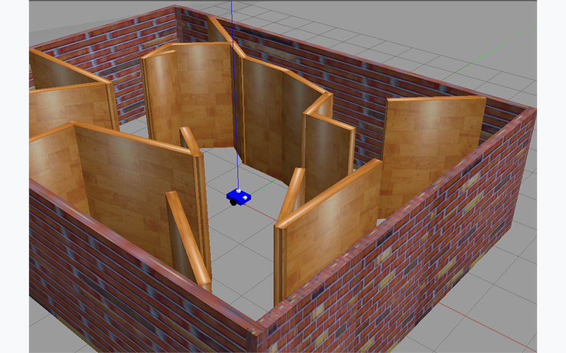
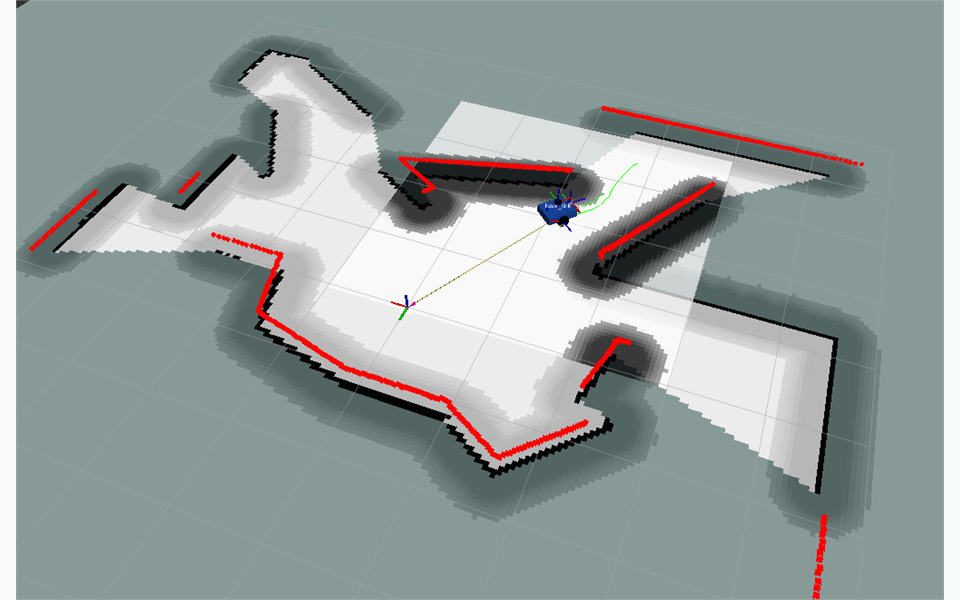
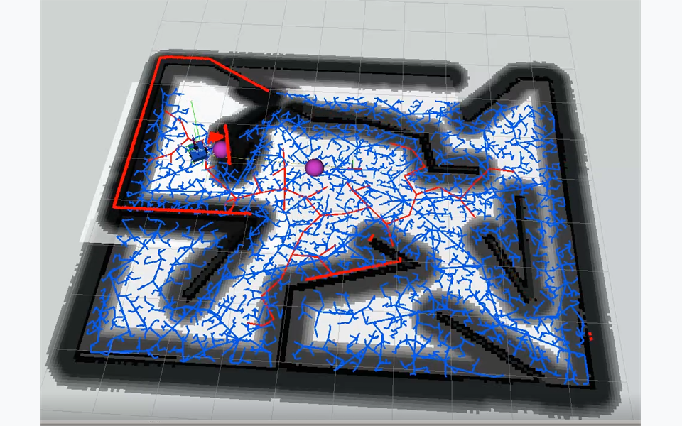
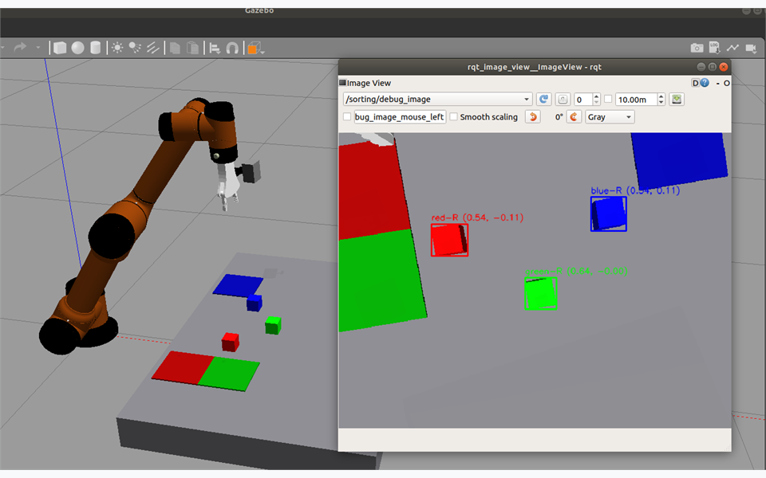
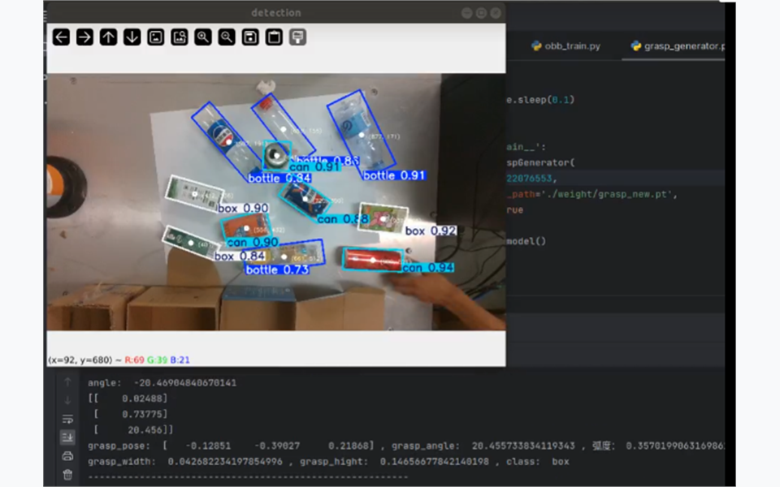
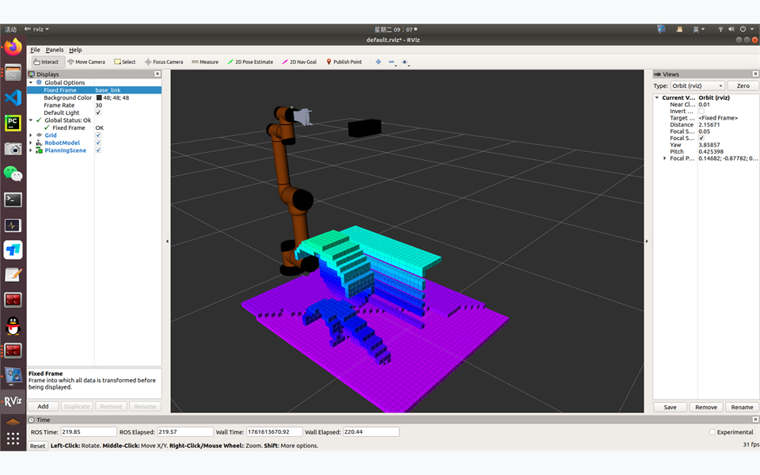

# WheelTec 学习与 AUBO 复合机器人项目

本仓库是一个兼容 **ROS 1 Melodic / Noetic + Gazebo Classic** 的机器人学习与开发项目。
项目以 WheelTec ROS 功能包为参考，学习移动机器人的底盘驱动、遥控、仿真、建图、
定位、导航、跟随和自主探索等实现方式；在此基础上，我们搭建了自己的差速移动
机器人，并进一步加入 AUBO i5 六轴机械臂，最终形成可完成移动、视觉识别、抓取和
分拣任务的复合移动机器人。

> 本仓库并不是对 WheelTec 原工程的简单复刻。WheelTec 相关功能包主要用于学习和
> 对照；`simple_diff_robot_gazebo`、`aubo_planning` 以及 `aubo_mobile_robot/`
> 下的功能包构成了本项目的主要实践成果。

## 项目演示


https://github.com/user-attachments/assets/b636e380-9148-4471-b0e5-202318e15bf4

[下载高清版本（MP4，约 22.7 MB）](aubo/video_or_img/sorting_process.mp4)

视频展示了项目中的目标识别、机械臂规划、抓取与分类放置流程。GitHub 若未直接
显示播放器，可点击链接打开或下载原视频。更多演示素材见
[`aubo/video_or_img/`](aubo/video_or_img/README.md)。

### 功能截图

| 差速机器人 Gazebo 场景 | 建图、定位与导航 |
| --- | --- |
|  |  |

| RRT 自主探索 | AUBO 视觉识别与三维定位 |
| --- | --- |
|  |  |

| YOLO OBB 目标检测 | MoveIt OctoMap 环境建模 |
| --- | --- |
|  |  |

## 项目演进路线

```text
WheelTec 原有功能包
  └─ 学习底盘、传感器、遥控、仿真、导航、跟随与 RRT 探索
       ↓
simple_diff_robot_gazebo
  └─ 自主搭建差速机器人，完成 Gazebo 仿真、建图、定位与导航
       ↓
aubo
  └─ 加入 AUBO i5 六轴机械臂、夹爪、MoveIt 规划与抓放示例
       ↓
aubo_mobile_robot
  └─ 融合移动底盘与六轴机械臂，实现导航、视觉抓取和颜色分拣
```

## 主要功能

### 1. WheelTec 功能学习与参考

项目保留了 WheelTec 机器人及其生态中的多个功能包，用于分析成熟移动机器人系统
的组织方式和数据链路。

| 功能包                   | 主要用途                                       |
| ------------------------ | ---------------------------------------------- |
| `turn_on_wheeltec_robot` | 真机底盘、雷达、相机启动，建图和导航入口       |
| `wheeltec_robot_rc`      | 键盘与手柄遥控                                 |
| `wheeltec_robot_gazebo`  | WheelTec 机器人模型、Gazebo 仿真、建图和导航   |
| `wheeltec_multi`         | 多机器人启动、遥控与导航                       |
| `simple_follower`        | 激光、视觉、AR 和巡线跟随实验                  |
| `rrt_exploration`        | 基于 RRT/frontier 的单机器人和多机器人自主探索 |

这些包帮助我们理解了 `/cmd_vel`、里程计、TF、激光雷达、SLAM、AMCL、
`move_base` 以及多机器人命名空间等 ROS 核心机制。

### 2. 差速移动机器人

`simple_diff_robot_gazebo` 是一个从模型开始搭建的简洁差速机器人，包含：

- 左右驱动轮和球形万向支撑轮；
- 二维激光雷达和 RGB 相机；
- 基于编码器里程计的 Gazebo 差速驱动；
- GMapping 建图、地图保存、AMCL 定位和 Navigation Stack 导航；
- DWA 局部规划与 RRT 自主探索建图；
- 自带安全看门狗的键盘遥控节点。

它用于把从 WheelTec 工程中学习到的完整移动机器人链路，落实到一个结构更精简、
参数更易理解的自主模型中。

### 3. AUBO 六轴机械臂

顶层 `aubo/` 目录包含 AUBO i5 六轴机械臂相关功能：

- `aubo_description`：机械臂、双指夹爪及相机模型；
- `aubo_gazebo`：Gazebo 仿真和 `ros_control` 控制器；
- `aubo_moveit_config`：MoveIt 运动规划配置；
- `aubo_planning`：夹爪控制、抓取和放置示例；
- `aubo_color_sorting`：固定底座机械臂的腕部相机颜色识别、抓取和分类放置；
- `aubo_perception`：固定和移动平台共用的视觉消息与颜色检测；
- `aubo_sorting_core`：固定和移动平台共用的 MoveIt 分拣状态机；
- `aubo_gazebo_plugins`：仿真场景共用的抓取辅助插件；
- `aubo_sdk`：AUBO 官方 SDK 头文件、运行库、只读连接测试和受保护运动示例；
- `aubo_ros_control`：真实机械臂 `RobotHW` 接口、轨迹控制器及 MoveIt 实机启动入口。

该部分覆盖从机器人描述、关节轨迹控制到运动规划和末端夹爪操作的基本流程。
固定与移动平台的共用能力、场景层边界及消息迁移说明见
[`aubo/README.md`](aubo/README.md)。

### 4. AUBO 复合移动机器人

`aubo_mobile_robot/` 将差速移动底盘、AUBO i5、双指夹爪、双激光雷达、腕部相机
和眼在手外 RGB-D 相机组合为一台移动操作机器人，主要功能包如下：

| 功能包                      | 主要用途                                                   |
| --------------------------- | ---------------------------------------------------------- |
| `aubo_mobile_robot`         | 复合机器人 Xacro、Gazebo 场景、传感器和控制器              |
| `aubo_mobile_moveit_config` | 移动机械臂的 MoveIt 规划配置                               |
| `aubo_mobile_navigation`    | 双雷达融合、GMapping、AMCL 和 `move_base`                  |
| `aubo_mobile_bringup`       | 机器人、导航、分拣和完整任务的统一仿真入口                 |
| `aubo_mobile_control`       | 底盘键盘控制及导航/机械臂顺序协调                          |
| `aubo_mobile_perception`    | 移动平台的视觉参数与启动入口（算法复用 `aubo_perception`） |
| `aubo_mobile_sorting`       | 红、绿、蓝方块的视觉抓取与分类放置                         |
| `aubo_mobile_nav_sorting`   | 导航到工位后执行自动分拣的完整任务编排                     |

完整任务流程为：

```text
机械臂收回安全姿态
→ 底盘定位并导航至分拣工位
→ 机械臂移动到相机观察位
→ 识别红、绿、蓝方块及其位置
→ MoveIt 规划抓取和放置轨迹
→ 夹爪完成分类分拣
→ 发布任务结果
```

## 系统架构

```text
                         ┌─ GMapping ──────────────── map
/front/scan ─┐           │
             ├─ /scan ───┼─ AMCL ── map → odom
/rear/scan ──┘           │
                         └─ move_base ────────────── /cmd_vel
                                                       │
                          odom ← 差速底盘 ←────────────┘

/workspace_camera/color + aligned_depth ─ YOLO/RGB-D适配 ─ /sorting/detections
/workspace_camera/depth/color/points ─ 点云过滤 ─ MoveIt OctoMap       │
                                                                     ▼
导航任务编排 ─ 底盘互锁/OctoMap就绪检查 ─ aubo_sorting_core ─ MoveIt
                                                          │
                                                          ├─ 机械臂轨迹控制器
                                                          └─ 夹爪轨迹控制器
```

移动底盘由 Navigation Stack 控制，机械臂由 MoveIt 控制。当前的复合任务采用
“先移动、后操作”的顺序协调方式，并不是底盘与机械臂同时参与的全身运动规划。
底盘到站后会清空并等待重建 OctoMap，机械臂规划和执行期间通过
`/sorting/base_locked` 禁止底盘运动。Gazebo 中的小物体夹持由
`aubo_gazebo_plugins` 辅助，真实机械臂不加载该插件。

## 安装、编译与环境加载

### 支持状态

本仓库维护同一套 Python 3 源码，目标环境为：

| 系统 | ROS | Python | 当前验证状态 |
| --- | --- | --- | --- |
| Ubuntu 18.04 | Melodic | Python 3 | 容器内 41 个活动包全量构建通过 |
| Ubuntu 20.04 | Noetic | Python 3 | 实际工作空间全量构建通过，3 项测试无失败 |

OpenCV 3（Melodic）和 OpenCV 4（Noetic）均已通过编译。这里的“兼容”指源码、依赖、
编译及无硬件启动检查通过；RealSense、雷达、WheelTec 控制器和 AUBO 真机仍需在
对应系统上完成实物验收。

### 1. 准备 Catkin 工作空间

本文假定目录结构如下，仓库内容位于工作空间的 `src` 中：

```text
~/aubo/ros_mobile_manipulation_lab/
├── build/                 # catkin_make 生成
├── devel/                 # catkin_make 生成
└── src/                   # 本仓库
    ├── CMakeLists.txt
    ├── setup_ros.sh
    ├── aubo/
    └── aubo_mobile_robot/
```

打开一个没有加载其他 ROS 发行版的终端，进入工作空间根目录并选择当前系统的 ROS：

```bash
cd ~/aubo/ros_mobile_manipulation_lab

# Ubuntu 18.04
source /opt/ros/melodic/setup.bash

# Ubuntu 20.04（与上一条二选一）
source /opt/ros/noetic/setup.bash
```

建议先退出 Conda：

```bash
conda deactivate 2>/dev/null || true
```

顶层 CMake 也会忽略仍处于激活状态的 Conda 前缀，避免 Conda protobuf 覆盖
Gazebo 使用的 Ubuntu 系统 ABI。

### 2. 安装系统依赖

初始化过 rosdep 后，在工作空间根目录执行：

```bash
sudo rosdep init  # 本机从未初始化 rosdep 时只执行一次
rosdep update
rosdep install --from-paths src --ignore-src -r -y
```

项目中的 Navigation、TEB、Karto、深度图转激光和 RealSense 驱动使用对应 ROS
发行版的系统包，不再编译仓库中的旧 Melodic/vendor 快照。如果需要手动补装常用
依赖，可执行：

```bash
sudo apt install \
  python3-pip python3-numpy python3-opencv python3-sklearn \
  libpcap-dev \
  ros-$ROS_DISTRO-navigation \
  ros-$ROS_DISTRO-gmapping \
  ros-$ROS_DISTRO-teb-local-planner \
  ros-$ROS_DISTRO-depthimage-to-laserscan \
  ros-$ROS_DISTRO-realsense2-camera \
  ros-$ROS_DISTRO-slam-karto \
  ros-$ROS_DISTRO-warehouse-ros-mongo
```

雷神 LSX10 驱动需要 `libpcap-dev`。缺少它时两个 LSX10 驱动会被明确标记为跳过，
不会阻塞 RPLIDAR 和其余工作空间；安装后重新运行 `catkin_make` 即会自动启用。

### 3. 安装 AUBO SDK 所需 protobuf ABI

仓库中的 AUBO 预编译 SDK 固定依赖 `libprotobuf.so.9`。不能将系统新版 protobuf
软链接成该文件；若系统中尚无这个 SONAME，请安装经过校验的 Ubuntu 兼容包：

```bash
curl -L --fail -o /tmp/libprotobuf9v5_2.6.1-1.3_amd64.deb \
  http://archive.ubuntu.com/ubuntu/pool/main/p/protobuf/libprotobuf9v5_2.6.1-1.3_amd64.deb
echo '8178472ae72a3242f4e1c78f38bfd137c5aadadcefc1980aee2ba9820be1d192  /tmp/libprotobuf9v5_2.6.1-1.3_amd64.deb' | sha256sum -c -
sudo apt install /tmp/libprotobuf9v5_2.6.1-1.3_amd64.deb
```

### 4. 编译主工作空间

Melodic 和 Noetic 都显式使用 `/usr/bin/python3`：

```bash
cd ~/aubo/ros_mobile_manipulation_lab
catkin_make -DPYTHON_EXECUTABLE=/usr/bin/python3
```

正常结果应以 `[100%]` 结束。较新 CMake 输出的 deprecation、CMP0148 等信息属于
ROS 1 旧版 CMake 模块的警告；只要命令退出码为 0，就不表示构建失败。

### 5. Melodic 专用：构建 Python 3 cv_bridge

Noetic 用户跳过本节。Melodic 的系统 `cv_bridge` 通常是 Python 2 ABI；需要视觉、
跟随、KCF、RRT 图像检测或 AUBO Python 感知节点时，执行：

```bash
cd ~/aubo/ros_mobile_manipulation_lab
python3 -m pip install --user \
  'catkin_pkg<1' 'rospkg<2' 'empy==3.3.4' defusedxml pyyaml
bash src/tools/build_melodic_python3_cv_bridge.sh
```

脚本会在工作空间根目录生成 `melodic_py3_cv_bridge_ws`。以后加载项目环境时，
`setup_ros.sh` 会在 Melodic 下自动加载这个 overlay。

### 6. 加载环境并验证

每个新终端都应执行：

```bash
cd ~/aubo/ros_mobile_manipulation_lab
source src/setup_ros.sh
```

该脚本只修改当前终端，不写入 `~/.bashrc`。它会选择已安装或当前已经加载的
Melodic/Noetic，加载 `devel/setup.bash`，并统一导出 Python 3 解释器。验证环境：

```bash
echo "$ROS_DISTRO"
python3 --version
rospack find aubo_sdk
rospack find aubo_mobile_bringup
rospack find robot_pose_ekf
rospack find rrt_exploration
```

可进一步执行仓库现有测试和 launch 静态展开检查：

```bash
catkin_make run_tests_robot_pose_ekf
catkin_test_results build/test_results

roslaunch --nodes turn_on_wheeltec_robot robot_model_visualization.launch
roslaunch --nodes aubo_mobile_navigation mapping_gazebo.launch
roslaunch --nodes aubo_mobile_navigation mapping_nav_gazebo.launch
```

### 7. 在 Melodic 与 Noetic 之间切换

不要让两个发行版复用同一组 `build/`、`devel/`。推荐分别建立两个工作空间；若确实
需要切换，应在干净终端中选择目标 ROS，并删除旧发行版生成的构建目录后重新编译。
删除前务必确认目标路径是本工作空间的 `build` 和 `devel`。

如同一系统安装了多个 ROS 发行版，可以在加载项目前指定：

```bash
export WHEELTEC_ROS_DISTRO=melodic  # 或 noetic
source src/setup_ros.sh
```

完整的保留范围、已隔离源码及双版本实现细节见
[ROS 1 双版本兼容说明](ROS1_COMPATIBILITY.md)。

## 快速开始

### 差速机器人：建图与导航

建图：

```bash
roslaunch simple_diff_robot_gazebo mapping.launch
roslaunch simple_diff_robot_gazebo teleop.launch
```

地图完成后另开终端保存：

```bash
roslaunch simple_diff_robot_gazebo map_saver.launch
```

关闭建图进程，再启动定位与导航：

```bash
roslaunch simple_diff_robot_gazebo navigation.launch
```

在 RViz 中先使用 **2D Pose Estimate** 设置初始位姿，再使用 **2D Nav Goal**
发送目标。RRT 自主探索可通过以下命令启动：

```bash
roslaunch simple_diff_robot_gazebo rrt_exploration.launch
```

### 独立 AUBO：运动规划与抓放

使用 MoveIt 假控制器快速验证夹爪与抓放规划：

```bash
roslaunch aubo_planning gripper_control.launch command:=cycle
roslaunch aubo_planning pick_place.launch
```

真实机械臂建议先运行只读 SDK 检查，再启动实机控制：

```bash
rosrun aubo_sdk sdk_test 192.168.1.2
roslaunch aubo_ros_control aubo_real_bringup.launch robot_ip:=192.168.1.2
```

实机接口说明、安全前置条件及状态只读模式见
[`aubo_ros_control/README.md`](aubo/aubo_ros_control/README.md)。

### 固定机械臂：颜色抓取分拣

该场景不加载移动底盘，使用高 `0.10 m` 的低桌面，并将 `upperArm_joint` 的模型与
MoveIt 位置限制统一为 `-60°` 到 `60°`：

```bash
roslaunch aubo_color_sorting sorting_gazebo.launch
rosservice call /sorting/start
```

默认不会自动开始抓取；可先在 RViz 和 `/sorting/debug_image` 中检查轨迹与识别结果。
完整参数和真实机械臂接入方式见
[`aubo_color_sorting/README.md`](aubo/aubo_color_sorting/README.md)。

### 复合机器人：基础仿真

```bash
roslaunch aubo_mobile_bringup simulation.launch mode:=robot
rosrun aubo_mobile_control keyboard_teleop.py
```

基础模型提供 `/cmd_vel`、`/odom`、`/front/scan`、`/rear/scan` 和手部相机图像，
并加载机械臂与夹爪轨迹控制器。

### 复合机器人：建图与导航

```bash
# Gazebo + 双雷达融合 + GMapping + RViz
roslaunch aubo_mobile_navigation mapping_gazebo.launch

# Gazebo + 双雷达融合 + GMapping + move_base + RViz
roslaunch aubo_mobile_navigation mapping_nav_gazebo.launch

# 保存地图
roslaunch aubo_mobile_navigation map_saver.launch

# 使用已有地图进行 AMCL 定位和导航
roslaunch aubo_mobile_navigation navigation_gazebo.launch \
  map_file:=$(rospack find aubo_mobile_navigation)/maps/map.yaml
```

底盘移动前应将机械臂收回 `home` 或 `down` 等安全姿态。

### 复合机器人：视觉分拣

```bash
roslaunch aubo_mobile_bringup simulation.launch mode:=sorting
```

系统进入 `READY` 后，可以在 RViz 的“AUBO 视觉分拣”面板中开始任务，也可以调用：

```bash
rosservice call /sorting/start
```

### 复合机器人：眼在手外 RGB-D 与 YOLO

真实移动抓取组合入口（复用 `aubo` 的相机、感知与眼在手外伺服）：

```bash
roslaunch aubo_mobile_bringup mobile_manipulation_visual_servo.launch \
  camera_serial_no:=<serial>
```

启动检测框与深度图的三维目标适配器：

```bash
roslaunch aubo_mobile_perception yolo_rgbd_detector.launch
```

首次联调必须使用禁止轨迹执行的 MoveIt 入口，在 RViz 中确认点云、TF、OctoMap和
规划轨迹后再连接真实机械臂：

```bash
roslaunch aubo_mobile_moveit_config octomap_validation.launch \
  load_robot_description:=false
```

完整接线、标定和检查顺序见
[`aubo_mobile_robot/EYE_TO_HAND_RGBD.md`](aubo_mobile_robot/EYE_TO_HAND_RGBD.md)。

### 复合机器人：导航到工位并分拣

一键启动完整 Gazebo 场景：

```bash
roslaunch aubo_mobile_bringup simulation.launch mode:=mission
```

系统稳定后启动任务：

```bash
rosservice call /nav_sorting/start
```

也可以在启动时自动执行：

```bash
roslaunch aubo_mobile_bringup simulation.launch mode:=mission auto_start:=true
```

## 关键接口

| 接口                                                 | 类型或作用                                                |
| ---------------------------------------------------- | --------------------------------------------------------- |
| `/cmd_vel`                                           | `geometry_msgs/Twist`，底盘速度指令                       |
| `/odom`                                              | `nav_msgs/Odometry`，轮式里程计                           |
| `/scan`                                              | 合并后的 360° 激光扫描                                    |
| `/move_base`                                         | 底盘导航 action                                           |
| `/hand_camera/image_raw`                             | 手部 RGB 相机图像                                         |
| `/workspace_camera/color/image_raw`                  | 眼在手外 RealSense 彩色图像                               |
| `/workspace_camera/aligned_depth_to_color/image_raw` | 对齐到彩色画面的深度图                                    |
| `/workspace_camera/points_for_moveit`                | 经过工作区过滤的 MoveIt OctoMap 点云                      |
| `/sorting/detections`                                | `aubo_perception/DetectedObjectArray`，颜色目标及定位结果 |
| `/sorting/state`                                     | 视觉分拣状态                                              |
| `/sorting/base_locked`                               | 机械臂规划/执行期间的底盘运动锁                           |
| `/clear_octomap`                                     | 底盘移动后清空 MoveIt OctoMap                             |
| `/nav_sorting/state`                                 | 导航分拣总任务状态                                        |
| `/aubo_i5_controller/follow_joint_trajectory`        | 六轴机械臂轨迹接口                                        |
| `/gripper_controller/follow_joint_trajectory`        | 双指夹爪轨迹接口                                          |

主要 TF 链路为：

```text
map → odom → base_footprint → base_link → AUBO links → tcp_link
```

建图时 `map → odom` 由 GMapping 发布；加载已有地图导航时由 AMCL 发布。两者不应
同时运行，否则会产生 TF 冲突。

## 推荐学习顺序

1. 阅读 `turn_on_wheeltec_robot` 和 `wheeltec_robot_rc`，理解真机启动与遥控接口。
2. 运行 `wheeltec_robot_gazebo`，观察模型、传感器、TF、建图和导航的数据流。
3. 学习 `simple_follower`、`wheeltec_multi` 和 `rrt_exploration` 的功能组织方式。
4. 运行 `simple_diff_robot_gazebo`，从 Xacro、差速插件开始理解差速移动机器人。
5. 分别完成差速机器人的建图、地图保存、AMCL 定位、目标导航和自主探索。
6. 学习 `aubo_description`、`aubo_gazebo` 和 `aubo_moveit_config`，理解机械臂模型、
   控制器、规划组、末端执行器和 Planning Scene。
7. 运行 `aubo_planning` 的夹爪及抓放示例。
8. 运行 AUBO 移动机械臂的导航、视觉识别和独立分拣。
9. 最后运行 `aubo_mobile_nav_sorting`，理解跨模块任务编排和复合机器人操作。

## 使用说明与限制

- 仿真环境和参数主要面向教学与功能验证，不能直接替代真机标定和安全测试。
- 导航 footprint 仅覆盖机械臂收拢状态；机械臂伸展时不要移动底盘。
- 腕部相机仍为 RGB 近距离观察相机；眼在手外 RealSense 提供目标三维定位和
  OctoMap 点云。两套相机的职责和 TF 发布源必须保持独立。
- 眼在手外相机的 Xacro 安装位姿仅是结构初值，真机抓取前必须重新完成相机内参、
  相机内部 TF、底盘到相机外参和 TCP 标定。
- Gazebo 分拣使用辅助抓取固定插件提高小方块抓取稳定性；真机仍需依赖实际夹爪、
  力学接触和安全策略。
- 真机运行前必须重新校准地图、雷达外参、相机内外参、工位位姿、TCP、夹爪开合量
  和机械臂关节限制，并设置限速、急停和碰撞保护。
- 仓库包含来源不同的第三方 ROS 功能包。使用、修改或再发布时，请分别遵守各目录
  中的许可证与原作者声明。

## 详细文档

- [差速机器人模型与导航](simple_diff_robot_gazebo/README.md)
- [AUBO 机械臂规划示例](aubo/aubo_planning/README.md)
- [AUBO SDK 与真实机械臂控制](aubo/aubo_ros_control/README.md)
- [AUBO 功能包分层说明](aubo/README.md)
- [AUBO 通用视觉感知](aubo/aubo_perception/README.md)
- [AUBO 通用分拣核心](aubo/aubo_sorting_core/README.md)
- [AUBO Gazebo 通用插件](aubo/aubo_gazebo_plugins/README.md)
- [AUBO 固定机械臂颜色抓取分拣](aubo/aubo_color_sorting/README.md)
- [AUBO 复合移动机器人概览](aubo_mobile_robot/README.md)
- [眼在手外 RGB-D、OctoMap、YOLO 与视觉伺服](aubo_mobile_robot/EYE_TO_HAND_RGBD.md)
- [项目演示视频与图片](aubo/video_or_img/README.md)
- [AUBO 移动机器人统一启动入口](aubo_mobile_robot/aubo_mobile_bringup/README.md)
- [复合机器人模型与仿真](aubo_mobile_robot/aubo_mobile_robot/README.md)
- [建图、定位与导航](aubo_mobile_robot/aubo_mobile_navigation/README.md)
- [底盘与机械臂协调控制](aubo_mobile_robot/aubo_mobile_control/README.md)
- [手部相机视觉感知](aubo_mobile_robot/aubo_mobile_perception/README.md)
- [视觉抓取与颜色分拣](aubo_mobile_robot/aubo_mobile_sorting/README.md)
- [导航与分拣完整任务](aubo_mobile_robot/aubo_mobile_nav_sorting/README.md)

## 致谢

本项目的学习、设计与实现离不开以下老师、课程、文档和开源项目的帮助，在此表示
诚挚感谢：

- 感谢 **赵虚左老师及 Autolabor 团队**制作的《ROS 理论与实践》系列教程。课程从
  ROS 基础通信机制出发，系统讲解了 TF、URDF、Gazebo 仿真、SLAM、导航和机器人
  平台搭建等内容，为本项目理解 ROS 系统结构、自主搭建差速机器人以及实现建图与
  导航功能提供了重要的学习基础。
  - [《ROS 理论与实践》视频课程](https://www.bilibili.com/video/BV1Ci4y1L7ZZ)
  - [《ROS 理论与实践》在线文档](https://www.autolabor.com.cn/book/ROSTutorials/)

- 感谢 **胡春旭老师 | 古月居**长期以来对 ROS 技术的讲解、实践与推广。《ROS
  入门 21 讲》帮助我们建立了对 ROS 节点、话题、服务、参数、TF 和 Launch 等核心
  概念的整体认识；相关进阶课程及《ROS机器人开发实践》一书，则为机器人建模、
  Gazebo 仿真、SLAM 与导航、机器视觉和机械臂开发等内容提供了系统参考。
  - [古月居《ROS 入门 21 讲》](https://www.bilibili.com/video/BV1zt411G7Vn)
  - [胡春旭老师 ROS 相关进阶视频课程](https://www.bilibili.com/video/BV14b411p7Hm)
  - 参考书籍：胡春旭，《ROS机器人开发实践》

- 感谢 **WheelTec ROS 工程及其开发团队**提供的移动机器人功能包与实践案例。
  本项目通过学习其中的底盘启动、遥控、传感器接入、Gazebo 仿真、跟随、多机器人、
  建图、定位、导航和 RRT 探索等功能，逐步完成了差速机器人、AUBO 六轴机械臂
  以及移动操作复合机器人的设计与集成。

- 感谢 **ROS、Gazebo、MoveIt、Navigation Stack、GMapping、OpenCV** 等开源项目
  及其社区贡献者。正是这些开放的软件、文档与经验分享，为本项目的学习和实现提供
  了可靠基础。

本仓库中的第三方功能包、模型和代码仍归原作者及相应项目所有。若本项目对相关
内容的来源标注存在遗漏，欢迎提出 Issue，我们会及时补充和修正。
