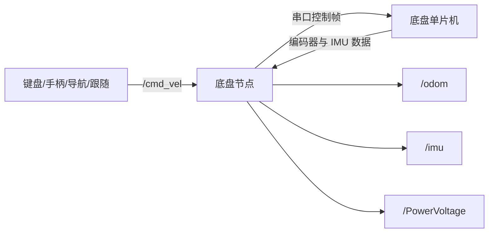
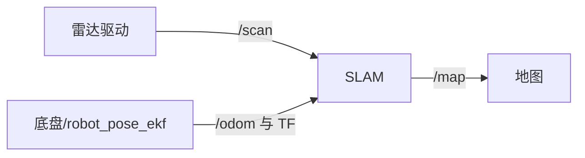
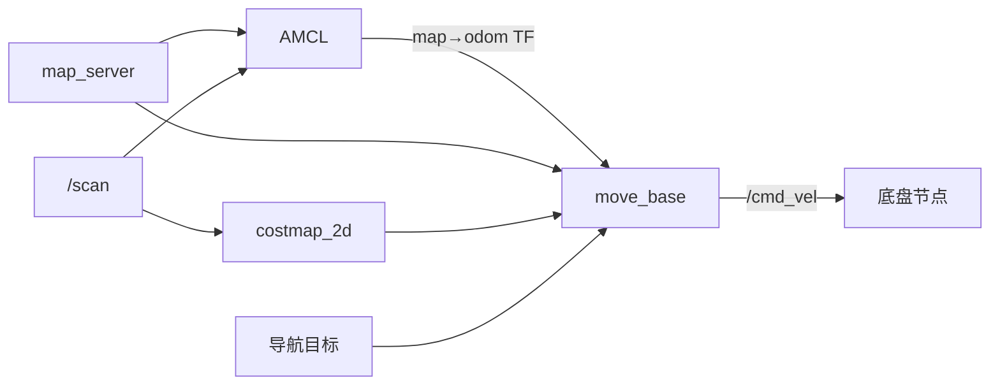

# 系统数据流

## 底盘控制闭环

```mermaid
flowchart LR
  A["键盘/手柄/导航/跟随"] -->|/cmd_vel| B["底盘节点"]
  B -->|串口控制帧| C["底盘单片机"]
  C -->|编码器与 IMU 数据| B
  B --> D["/odom"]
  B --> E["/imu"]
  B --> F["/PowerVoltage"]
```

## 建图数据流

```mermaid
flowchart LR
  L["雷达驱动"] -->|/scan| S["SLAM"]
  O["底盘/robot_pose_ekf"] -->|/odom 与 TF| S
  S -->|/map| M["地图"]
```

## 导航数据流

```mermaid
flowchart LR
  M["map_server"] --> A["AMCL"]
  L["/scan"] --> A
  A -->|map→odom TF| N["move_base"]
  M --> N
  L --> C["costmap_2d"]
  C --> N
  G["导航目标"] --> N
  N -->|/cmd_vel| B["底盘节点"]
```

## 推荐追踪方式

看到一个输出话题时，逆向回答：

1. 谁发布它？
2. 发布节点由哪个 launch 启动？
3. launch 加载了哪些参数？
4. 节点又订阅了什么？
5. 消息和 TF 的时间戳是否一致？

