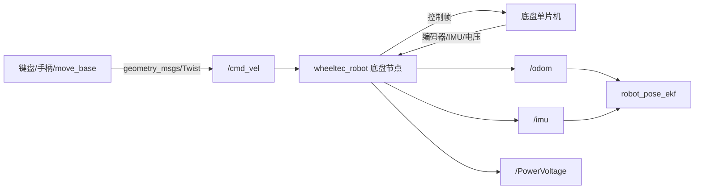

# 底盘与控制

这一层连接 ROS 与真实小车，是所有建图、导航和跟随功能的基础。上层只发布速度，底盘节点负责把速度变成串口协议，并把编码器、IMU 和电池数据重新发布为 ROS 消息。

## 包与职责

| 包 | 职责 | 建议深度 |
|---|---|---|
| [[功能包/turn_on_wheeltec_robot]] | 串口通信、运动命令、里程计、IMU、车型与 TF 总入口 | 精读 |
| [[功能包/wheeltec_robot_rc]] | 键盘事件转换为速度指令 | 精读 |
| `wheeltec_joy` | 手柄轴和按键转换为运动控制 | 选读 |
| `robot_pose_ekf` | 融合轮式里程计和 IMU，输出 `odom_combined` | 理解配置 |
| `fdilink_ahrs` | 外置 AHRS/IMU 串口驱动 | 按硬件选读 |

## 核心数据流



## 关键接口

| 接口 | 类型 | 含义 |
|---|---|---|
| `/cmd_vel` | `geometry_msgs/Twist` | `linear.x/y` 与 `angular.z` 运动指令 |
| `/odom` | `nav_msgs/Odometry` | 位置、姿态、速度和协方差 |
| `/imu` | `sensor_msgs/Imu` | 角速度、线加速度和姿态 |
| `/PowerVoltage` | `std_msgs/Float32` | 电池电压 |
| TF | `odom_combined → base_footprint` | 机器人局部位姿关系 |

## 启动与观察

```bash
roslaunch turn_on_wheeltec_robot turn_on_wheeltec_robot.launch
roslaunch wheeltec_robot_rc keyboard_teleop.launch
rostopic echo /cmd_vel
rostopic echo /odom
rostopic hz /imu
rqt_graph
```

## 源码阅读顺序

1. `turn_on_wheeltec_robot.launch`：确认 `car_mode` 和被包含的文件。
2. `launch/include/base_serial.launch`：确认串口、波特率、frame 和校准参数。
3. `src/wheeltec_robot.cpp` 构造函数：找 Publisher、Subscriber 和参数。
4. `Cmd_Vel_Callback`：速度如何限幅、缩放与编码。
5. 串口接收解析：校验位、数据单位与正负号。
6. 里程计积分、协方差和 IMU 发布。

## 差速运动学要点

对于左右轮速度 $v_l,v_r$、轮距 $L$：

$$v=(v_r+v_l)/2,\quad \omega=(v_r-v_l)/L$$

直行时两轮同速，原地旋转时两轮等速反向。实际打滑、轮径误差和轮距误差会使里程计漂移，因此导航还需要激光定位修正。

## 实验清单

- [ ] 发布固定 `/cmd_vel`，验证直行、转弯和停止。
- [ ] 测量实际一米与 `/odom` 一米的误差。
- [ ] 修改里程计比例参数并再次测量。
- [ ] 检查多个速度发布者，避免键盘和导航同时控制。
- [ ] 断开通信或松开按键后确认机器人能收到零速度。

## 常见问题

- 小车不动：串口设备或权限、急停、`cmd_vel` 话题名、车型配置错误。
- 方向相反：电机方向、编码器符号或坐标轴定义错误。
- 里程计漂移：轮径/轮距不准、地面打滑、积分周期或单位错误。
- TF 跳变：底盘节点和 EKF 重复发布同一变换。

关联：[[03-建图定位与导航]]、[[03-运行与调试手册]]。

---

[[00-分类导览|分类导览]] · [[00-首页|知识库首页]] · 下一篇 [[02-传感器与驱动]]
