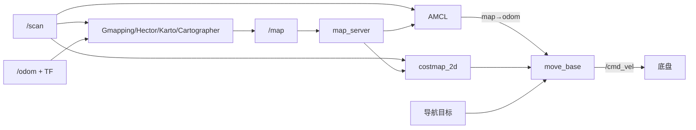

# 建图、定位与导航

这三项功能容易混淆：建图同时估计机器人轨迹与地图；定位在已有地图中估计机器人位姿；导航根据目标、地图和实时障碍计算 `/cmd_vel`。

## 整体数据流



## 建图算法

| 算法 | 特点 | 适合学习点 |
|---|---|---|
| Gmapping | 粒子滤波，依赖较好的里程计 | 默认入门 |
| Hector | 强调高频激光匹配，可弱化里程计依赖 | 观察雷达频率影响 |
| Karto | 图优化式二维 SLAM | 理解位姿图和闭环 |
| Cartographer | 子地图、扫描匹配与图优化 | 配置复杂，最后学习 |

真机统一入口：

```bash
roslaunch turn_on_wheeltec_robot mapping.launch
roslaunch turn_on_wheeltec_robot mapping.launch mapping_mode:=karto
```

教学差速车入口：

```bash
roslaunch simple_diff_robot_gazebo mapping.launch
roslaunch simple_diff_robot_gazebo teleop.launch
```

建图质量取决于 `/scan`、里程计、TF 和运动方式。应低速行驶、减少急转、覆盖闭环路线，地图完成后再保存。

## 定位：map_server 与 AMCL

`map_server` 从 YAML/PGM 加载静态地图；AMCL 使用激光与地图匹配，发布 `map → odom`。底盘或仿真插件发布 `odom → base_footprint`，两段组合得到机器人在地图中的位置。

关键 AMCL 参数：粒子数量、激光模型、里程计模型、更新距离/角度和初始位姿。启动后必须在 RViz 用 `2D Pose Estimate` 给出近似初始位置。

## 导航：move_base

`move_base` 不是单个规划算法，而是调度框架：

- `global_costmap`：静态地图、长期全局障碍。
- `local_costmap`：机器人附近实时障碍，通常滚动窗口。
- `Navfn/GlobalPlanner`：从当前位置到目标的全局路径。
- `DWA/TEB`：计算短期可执行速度。
- recovery behaviors：规划失败后的清图、旋转等恢复动作。

真机入口：`roslaunch turn_on_wheeltec_robot navigation.launch`；教学车入口：`roslaunch simple_diff_robot_gazebo navigation.launch`。

## 参数理解顺序

1. `global_frame`、`robot_base_frame`、`scan` 话题。
2. footprint/robot radius 与 inflation radius。
3. obstacle/raytrace range。
4. 最大速度、加速度和目标容差。
5. DWA/TEB 轨迹评分权重。

## 验证清单

- [ ] `rosrun tf tf_echo map base_footprint` 连续可用。
- [ ] 激光与静态地图在 RViz 中重合。
- [ ] 全局和局部代价地图能标记并清除障碍。
- [ ] 全局路径绕开固定障碍。
- [ ] 局部规划器发布 `/cmd_vel`。
- [ ] 到达目标后速度归零。

## 常见故障定位

- 地图不更新：缺少 `/scan` 或 `odom ↔ base` TF。
- AMCL 漂移：初始位姿错误、雷达 TF 错、环境特征少。
- `move_base` 报 transform timeout：TF 断裂或时间戳不同步。
- 机器人原地振荡：footprint、膨胀半径、最小速度或角速度参数不合理。
- 全局有路但不动：局部代价地图把机器人包围，或局部规划器无有效轨迹。

关联：[[01-底盘与控制]]、[[02-传感器与驱动]]、[[功能包/simple_diff_robot_gazebo]]。

---

上一篇 [[02-传感器与驱动]] · [[00-分类导览|分类导览]] · 下一篇 [[04-跟随与自主行为]]
