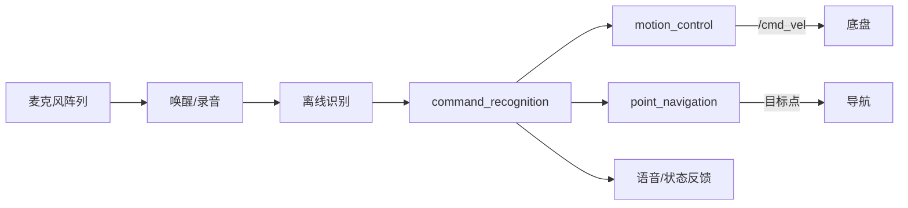

# 语音与人机交互

这一类功能把语音、人体姿态或 GUI 输入转换为机器人命令。它们往往会间接启动底盘、导航或跟随节点，因此要特别注意重复启动和控制权冲突。

## 离线语音链路

`xf_mic_asr_offline` 包含麦克风阵列配置、唤醒角度、录音、离线识别、命令解析、运动控制、点位导航和反馈。`base.launch` 会组合导航、激光目标、识别调用、命令识别、运动控制和反馈等节点；`mic_init.launch` 启动实际语音控制节点。



常用入口：

```bash
roslaunch xf_mic_asr_offline base.launch
roslaunch xf_mic_asr_offline mic_init.launch
```

包内 `.srv` 定义了开始录音、设置主麦克风、LED、唤醒词、读取识别结果和唤醒角度等硬件接口。阅读时先看服务定义，再看 `voice_control.cpp`、`command_recognition.cpp`、`motion_control.cpp` 和 `point_navigation.cpp`。

## TTS

`tts`（目录 `tts_make`）把文本转换为音频，入口为：

```bash
roslaunch tts tts_make.launch
```

学习重点是输入文本来源、音频文件输出位置、是否依赖在线服务/本地 SDK，以及播放是否阻塞控制线程。

## 人体骨架与姿态

`bodyreader` 依赖 Astra 人体 SDK。`main` 获取人体数据，`bodydata_process` 整理关节与姿态，`follower` 负责人体跟随，`interaction` 把姿态映射为控制，`feedback` 和显示节点负责反馈。

```bash
roslaunch bodyreader bodyinteraction.launch
roslaunch bodyreader bodyfollow.launch
roslaunch bodyreader final.launch
```

`final.launch` 同时组合姿态控制和跟随，模式切换本身就是一个值得研究的状态机。

## Qt 上位机

`qt_ros_test` 面向远程控制、图像与功能启动。学习它时区分 GUI 线程与 ROS 回调线程，并追踪按钮最终调用的是话题、服务还是外部 shell 命令。

## 风险与实验

- [ ] 先只打印识别结果，不控制电机。
- [ ] 为语音命令设计白名单和明确反馈。
- [ ] 测试误唤醒、环境噪声和同音词。
- [ ] 检查语音、键盘、导航是否争用 `/cmd_vel`。
- [ ] 人体丢失、骨架置信度过低时必须停车。
- [ ] 确认厂商 `.so`、模型和 USB 设备与目标架构匹配。

`xf_mic_asr_offline_circle` 是语音功能的变体，应先掌握主包，再用 launch/include 和源码差异比较它增加了什么行为。

---

上一篇 [[05-视觉与深度学习]] · [[00-分类导览|分类导览]] · 下一篇 [[07-仿真可视化与多机]]
