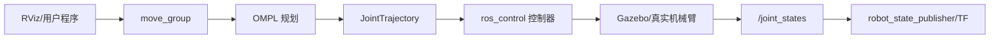

# 机械臂

仓库中的 `aubo` 是相对独立的机械臂子系统，包含模型、Gazebo 和 MoveIt 配置。它与移动底盘共享 ROS、TF 和仿真基础，但控制对象从底盘速度变成多关节轨迹。

## 包的分工

| 包 | 内容 |
|---|---|
| `aubo_description` | Aubo i5 等模型、关节、网格和显示文件 |
| `aubo_gazebo` | Gazebo 世界、控制器和机械臂 bringup |
| `aubo_moveit_config` | SRDF、OMPL、运动学、控制器、MoveGroup 和 RViz |

## 数据链路



## 推荐启动顺序

```bash
# 只进行 MoveIt 假执行，适合入门
roslaunch aubo_moveit_config demo.launch

# Gazebo 中规划并真实执行仿真关节
roslaunch aubo_moveit_config demo_gazebo.launch
```

`demo.launch` 使用 fake controller，轨迹只在 RViz 中插值显示；`demo_gazebo.launch` 会启动 Gazebo、真实控制器、`move_group` 和 RViz。理解两者差异能避免“RViz 动了但 Gazebo 不动”的困惑。

## 关键概念

- URDF：物理关节、连杆、碰撞和惯量。
- SRDF：规划组、末端执行器、虚拟关节和禁用碰撞对。
- planning group：一次规划控制的关节集合。
- kinematics：正逆运动学插件与求解参数。
- planning pipeline：本项目默认 OMPL。
- controller：接收规划轨迹并执行。
- planning scene：机器人、环境障碍和碰撞状态。

## 阅读顺序

1. `aubo_description` 的 Xacro 与 joint 命名。
2. `aubo_moveit_config/config` 中 SRDF、运动学和 OMPL 配置。
3. `demo.launch` 如何组合 `robot_state_publisher`、`move_group` 和 RViz。
4. `move_group.launch` 的规划与轨迹执行配置。
5. `ros_controllers.launch` 及 controller YAML。
6. `demo_gazebo.launch` 如何替换 fake execution。

## 实验任务

- [ ] 在 RViz 设置随机合法目标并规划。
- [ ] 观察碰撞目标导致规划失败。
- [ ] 比较 fake execution 和 Gazebo execution。
- [ ] 查看 `/joint_states` 与 TF 树。
- [ ] 调整速度缩放，确认轨迹执行时间变化。
- [ ] 增加一个碰撞物体并重新规划。

## 常见问题

- 模型姿态异常：joint origin/axis 或单位错误。
- 规划失败：目标不可达、碰撞、起始状态非法或 IK 无解。
- 规划成功但不执行：控制器未加载、关节名不匹配或 action 名错误。
- Gazebo 抖动：惯量、PID、质量比例或时间步不合理。

移动机械臂还需处理底盘 `map/odom/base_link` 与机械臂基座 TF 的统一，建议先分别掌握移动底盘和机械臂，再做系统集成。

---

上一篇 [[07-仿真可视化与多机]] · [[00-分类导览|分类导览]] · 下一篇 [[09-基础库与消息包]]
