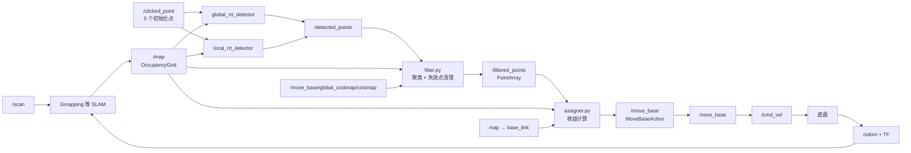

# rrt_exploration 详解

## 1. 它解决的是什么问题

`rrt_exploration` 让机器人在未知环境中自动决定“下一步去哪里”，并把目标交给 ROS Navigation Stack。机器人移动后，SLAM 获得新的激光观测并扩展 `/map`，探索器再从新地图中寻找下一批目标，直到没有值得探索的 frontier。

这里的 RRT **不是 `move_base` 的路径规划器**：

- RRT 负责在占据栅格中搜索 frontier 候选点；
- `filter.py` 负责聚类、去重和删除失效候选点；
- `assigner.py` 负责选择目标并通过 action 发送给 `move_base`；
- `move_base` 的 GlobalPlanner 与 TEB/DWA 才负责规划路径和输出 `/cmd_vel`；
- SLAM 根据 `/scan`、里程计和 TF 继续生成地图。

因此，自主探索是建立在“底盘 + 雷达 + TF + SLAM + Navigation”全部正常之上的闭环应用，不是一个可以脱离导航单独控制小车的算法。

## 2. 当前仓库状态（先看这一节）

`rrt_exploration/` 已从模式为 `160000` 的 gitlink 转换成主仓库直接跟踪的普通源码目录。现在可以在主仓库中逐文件查看、提交和回退 RRT 代码，不再依赖缺失的 `.gitmodules`。

转换前的嵌套仓库基于上游提交 `c107c9e`，其 Git 元数据已移动到系统临时目录备份；当前主仓库保留了完整的 WHEELTEC 定制代码，包括 `wait_for_fin`、`/move_base/global_costmap/costmap` 适配、过滤规则、RRT 参数和坐标系修改。

本仓库仍保留了 WHEELTEC 的适配启动文件：

- `turn_on_wheeltec_robot/launch/rrt_slam.launch`：自主建图总入口；
- `turn_on_wheeltec_robot/launch/simple.launch`：探索节点和参数；
- `turn_on_wheeltec_robot/launch/mapping.launch`：雷达、SLAM、底盘及导航；
- `turn_on_wheeltec_robot/launch/include/teb_local_planner.launch`：`move_base` 与代价地图。

本页以当前本地代码为主，同时标注它与上游 `hasauino/rrt_exploration` 的差异。核心 RRT、过滤和分配框架来自上游，`wait_for_fin` 与若干防碰撞/话题适配属于 WHEELTEC 定制。

## 3. 必备概念

### 3.1 占据栅格

输入地图类型是 `nav_msgs/OccupancyGrid`。原始实现重点识别三种数值：

| 数值 | 语义 | 在 RRT 中的作用 |
|---:|---|---|
| `-1` | 未知 | RRT 从自由区首次进入未知区时产生 frontier |
| `0` | 自由 | 树枝可以继续生长 |
| `100` | 占据 | 树枝停止，不能产生候选点 |

世界坐标 $(x,y)$ 到一维栅格索引的核心变换是：

$$
i=\left\lfloor\frac{y-y_0}{r}\right\rfloor W+
  \left\lfloor\frac{x-x_0}{r}\right\rfloor
$$

其中 $(x_0,y_0)$ 是地图原点，$r$ 是分辨率，$W$ 是地图宽度。

### 3.2 Frontier

Frontier 是“已知自由空间与未知空间的交界”。去这个位置通常能让激光看到一片尚未建图的区域，所以它适合作为探索目标。

候选 frontier 不等于最终导航目标。一个候选点可能已经被探明、位于膨胀障碍中、与其他候选点重复，或对另一台机器人更合适，所以还需要过滤和分配。

### 3.3 为什么使用全局树和局部树

- 全局 RRT 从用户给定的固定起点持续生长，树不会在发现 frontier 后清空，适合覆盖整个探索区域。
- 局部 RRT 每次发现 frontier 后清空树，并通过 TF 把根节点重置为机器人当前位置，适合快速搜索机器人附近的新边界。

二者都向 `/detected_points` 发布，形成互补候选点集合。它们不是两个层级的路径规划器。

## 4. 完整数据流



闭环的关键是：`/map` 变化会让旧 frontier 的信息增益下降，过滤器删掉旧目标，分配器再选择新目标。

## 5. 六个节点逐个理解

### 5.1 `global_rrt_detector`

源码入口：`src/global_rrt_detector.cpp`、`src/functions.cpp`。

算法必须先有有效地图，再接收 RViz 的 5 个 `/clicked_point`。当前 WHEELTEC 版本把“等待地图”的源码循环注释掉了，因此运行时需要人为保证这一顺序。初始化完成后每轮执行：

1. 在用户给定矩形中均匀采样 $x_{rand}$；
2. 在树节点集合 $V$ 中寻找欧氏距离最近的 $x_{nearest}$；
3. 用 `eta` 限制一次延伸距离，得到 $x_{new}$；
4. `ObstacleFree()` 以地图分辨率的 0.2 倍为间隔检查线段；
5. 全为自由栅格：把新节点和树边加入 RRT；
6. 碰到占据栅格：丢弃该次延伸；
7. 首次碰到未知栅格：把交界位置发布到 `/detected_points`。

可将 `Steer` 理解为：

$$
x_{new}=x_{nearest}+
\min\!\left(1,\frac{\eta}{\lVert x_{rand}-x_{nearest}\rVert}\right)
(x_{rand}-x_{nearest})
$$

> [!note] 初始化点的实现细节
> 官方说明要求前 4 点描述探索矩形，第 5 点是树根。源码实际上用第 1 点和第 3 点计算轴对齐矩形及中心，第 2、4 点只进入了可视化列表。因此应按矩形四角顺序点击，并确保第 1、3 点为对角点；第 5 点必须位于已知自由空间内。

### 5.2 `local_rrt_detector`

源码入口：`src/local_rrt_detector.cpp`。

主体与全局检测器相同，差异发生在检测到未知区之后：

1. 发布 frontier；
2. 清空节点集合和可视化树边；
3. 查询 `map_topic` 对 `robot_frame` 的 TF；
4. 用机器人当前坐标重新建立只有一个根节点的树。

所以局部树会不断“从机器人脚下重新出发”。如果这里一直等待 TF，优先检查 `map → odom_combined → base_footprint → base_link` 是否连通。

### 5.3 `frontier_opencv_detector.py`（可选）

源码入口：`scripts/frontier_opencv_detector.py`、`scripts/getfrontier.py`。

它把占据栅格转换为灰度图，通过二值化、Canny 边缘、轮廓提取和矩计算轮廓中心，再同样发布到 `/detected_points`。它可以与任意数量的 RRT 检测器并行使用，但并非 WHEELTEC `simple.launch` 的默认节点。

这个节点依赖旧版 OpenCV `findContours()` 的三返回值形式，直接运行在 OpenCV 4 上通常需要兼容修改。

### 5.4 `filter.py`

过滤器不是简单“通过/丢弃”，而是维护一份候选集合：

1. 将 `/detected_points` 通过 TF 转换到地图坐标系；
2. 用 MeanShift 聚类，当前源码带宽固定为 `0.5 m`（上游原值为 `0.3 m`）；
3. 以聚类中心代替密集、重复的原始候选点；
4. 把中心变换到每台机器人的 global costmap 坐标系；
5. 若任一代价地图值大于 `costmap_clearing_threshold`，删除该点；
6. 若半径 `info_radius/2` 内占据值之和大于 `1000`，删除障碍物周围的候选点；
7. 若同一范围内的未知面积小于 `0.2 m²`，也删除该点；
8. 发布 `rrt_exploration/PointArray` 到 `/filtered_points`。

`PointArray.msg` 的结构只有一项：

```text
geometry_msgs/Point[] points
```

### 5.5 `assigner.py`

分配器为每个“可用机器人—frontier”组合计算收益：

$$
R_{ij}=\lambda I(f_j)-\lVert p_i-f_j\rVert
$$

- $I(f_j)$：以 frontier 为圆心、`info_radius` 为半径的未知栅格面积；
- $\lambda$：`info_multiplier`；
- 距离项：机器人当前位置到 frontier 的直线距离；
- 若目标位于机器人 `hysteresis_radius` 内，信息增益再乘 `hysteresis_gain`，鼓励连续探索当前区域。

分配器还会对已经分给机器人的区域调用 `discount()`，降低重叠 frontier 的信息增益，减少多机重复劳动。最大收益组合通过 `MoveBaseAction` 发往 `<namespace>/move_base`。

> [!important] 收益中的 cost 是直线距离
> `functions.py` 虽然实现了 `makePlan()` 和 `pathCost()`，但当前 `assigner.py` 没有调用它们。隔墙很近的目标可能获得过高收益；若实际运行频繁出现这种选择，应考虑用全局路径长度替代欧氏距离，并对无可达路径返回无穷代价。

### 5.6 `wait_for_fin`

源码入口：`src/wait_for_fin.cpp`。这是 WHEELTEC 新增的探索结束与语音/地图保存辅助节点，不属于上游五节点算法。

它订阅 `/clicked_point` 和 `/odom`。收到至少 5 个初始化点后，若连续 `waiting_time` 次循环观察到线速度与角速度都小于 `0.005`，则：

1. 在新终端启动 `turn_on_wheeltec_robot/map_saver.launch`；
2. 杀掉 `/assigner`，停止继续派发探索目标；
3. 再等待约 5 次循环，向 `/move_base_simple/goal` 发布原点 `(0,0)`；
4. 在 `/overmap_flag` 发布 `1`，通知其他 WHEELTEC 节点建图结束。

节点启动后还会在 `rrt_flag` 发布一次 `1`，表示自主建图已开启。主循环为 `1 Hz`，所以计数值大致可以按秒理解：`rrt_exploration/launch/simple.launch` 配置 `50`，实际总入口使用的 `turn_on_wheeltec_robot/launch/simple.launch` 配置 `20`。

> [!caution] 完成判定只是“长时间不动”启发式
> 它不判断 frontier 是否耗尽，也没有对速度取绝对值；负向速度也会满足“小于 0.005”。此外，它依赖 `dbus-launch`、`gnome-terminal` 和 shell 命令保存地图/杀节点。无桌面环境、速度带噪声或导航卡死时，都可能误判或无法完成后处理。

## 6. 节点、话题、Action 与 TF

| 节点 | 订阅 | 发布/调用 | 关键 TF |
|---|---|---|---|
| `global_rrt_detector` | `/map`、`/clicked_point` | `/detected_points`、`/global_detector_shapes` | 无 |
| `local_rrt_detector` | `/map`、`/clicked_point` | `/detected_points`、`/local_detector_shapes` | `map → base_link` |
| `filter.py` | `/map`、`/detected_points`、global costmap | `/filtered_points`、`/frontiers`、`/centroids` | 候选点与地图/代价地图坐标系之间 |
| `assigner.py` | `/map`、`/filtered_points` | `/move_base` action goal | `map → base_link` |
| `frontier_opencv_detector.py` | `/map` | `/detected_points`、`/shapes` | 无 |
| `wait_for_fin` | `/clicked_point`、`/odom` | `/move_base_simple/goal`、`rrt_flag`、`overmap_flag` | 无 |

`global_detector_shapes` 和 `local_detector_shapes` 的实际名字由节点名加 `_shapes` 得到，通常用于在 RViz 看蓝色全局树和红色局部树。

## 7. 参数表与调参逻辑

### 7.1 检测器

| 参数 | WHEELTEC 值 | 作用 | 调大后的主要影响 |
|---|---:|---|---|
| 全局 `eta`（`Geta`） | `2.0 m` | 全局树单步长度 | 扩展更快，但更容易漏掉窄小区域 |
| 局部 `eta` | `0.5 m` | 局部树单步长度 | 附近检测更快，精细度下降 |
| `map_topic` | `/map` | SLAM 地图 | 必须与实际地图话题一致 |
| `robot_frame` | `base_link` | 局部树重置位置 | 必须能从地图坐标系查询到 |

建议先满足：地图分辨率 $<\eta<$ 走廊宽度。先只开全局树验证检测，再开局部树对比速度。

### 7.2 过滤器

| 参数 | WHEELTEC 值 | 作用 |
|---|---:|---|
| `info_radius` | `0.8 m` | 估计候选点周围未知面积 |
| `costmap_clearing_threshold` | `70` | 大于该代价值的候选点被删除 |
| `goals_topic` | `/detected_points` | 原始候选点输入 |
| `global_costmap_topic` | 默认 `/move_base/global_costmap/costmap` | 每台机器人全局代价地图后缀 |
| `n_robots` | `1` | 机器人数量 |
| `namespace` | 空 | 单机器人无命名空间 |
| `rate` | `100 Hz` | 过滤循环频率 |

### 7.3 分配器

| 参数 | WHEELTEC 值 | 作用 |
|---|---:|---|
| `info_radius` | `1.0 m` | 信息增益统计半径 |
| `info_multiplier` | `3.0` | 信息量相对距离的权重 |
| `hysteresis_radius` | `3.0 m` | 连续探索偏置的作用范围 |
| `hysteresis_gain` | `2.0` | 范围内信息增益的放大倍数，应大于 1 |
| `delay_after_assignement` | `0.5 s` | 每次派发后的等待时间 |
| `frontiers_topic` | `/filtered_points` | 过滤后候选点输入 |
| `global_frame` | `map` | action goal 与机器人位置的参考系 |
| `plan_service` | `/move_base/GlobalPlanner/make_plan` | 规划服务；当前收益计算并未使用 |

调参时一次只改一组：先保证候选点正确，再调过滤阈值，最后调整收益。`info_multiplier` 越大越重视未知面积；越小越偏向近处目标。`hysteresis_gain` 过大可能让机器人固守局部区域。

## 8. WHEELTEC 启动链路

运行入口：

```bash
roslaunch turn_on_wheeltec_robot rrt_slam.launch
```

其包含关系是：

```text
rrt_slam.launch
├── simple.launch
│   ├── global_rrt_detector
│   ├── local_rrt_detector
│   ├── filter.py
│   ├── assigner.py
│   └── wait_for_fin（WHEELTEC 扩展，当前源码已包含）
└── mapping.launch navigation:=true
    ├── wheeltec_lidar.launch
    ├── Gmapping（默认）
    ├── 底盘、模型与 robot_pose_ekf
    └── move_base + TEB + global/local costmap
```

XML 中两个 include 的节点会由 roslaunch 一起启动；并不是 `simple.launch` 全部运行完之后才启动建图。探索节点各自等待 `/map`、代价地图、TF 或 action server。

### 8.1 当前本地定制的重点检查

- global costmap 默认值已从上游 `/move_base_node/global_costmap/costmap` 改为与本仓库一致的 `/move_base/global_costmap/costmap`，仍应通过 `rostopic list` 实测确认。
- MeanShift 带宽由 `0.3 m` 改为 `0.5 m`，候选点会合并得更积极。
- 新增 `checkAround()`：半径范围内的正占据值之和超过 `1000` 时删除候选点，降低目标贴近障碍的概率。
- 全局/局部检测器等待有效地图的循环被注释，并把 Marker frame 固定为 `map`。如果 5 点点击得早于第一帧地图，检测器可能访问空地图；务必先看到 `/map` 再初始化。
- `assigner.py`、`filter.py`、`frontier_opencv_detector.py` 和 `getfrontier.py` 已在主仓库索引中保留 `100755` 可执行位。部署到 Linux 后仍可用 `ls -l` 检查实际权限。
- `wait_for_fin` 已加入 `CMakeLists.txt`，可被 catkin 编译；它是厂家启发式收尾逻辑，不是 RRT 算法的完成证明。

## 9. 从零运行与 RViz 初始化

本仓库的教学差速车已经提供联合仿真入口：

```bash
roslaunch simple_diff_robot_gazebo rrt_exploration.launch
```

该入口同时启动 Gazebo、Gmapping、`move_base` 和四个核心探索节点，并使用专用 RViz 配置；它不会启动会与 Gmapping 冲突的 AMCL/map_server，也不会启动依赖真机保存流程的 `wait_for_fin`。

WHEELTEC 厂家 Gazebo 模型也提供了独立入口：

```bash
roslaunch wheeltec_gazebo_function rrt_exploration.launch car_mode:=mini_mec
```

可将 `car_mode` 改为 `mini_4wd`、`mini_akm` 或 `mini_mec_control`。该入口复用厂家 Gmapping、车型控制、TEB 和 RViz 配置，并将 assigner 的规划服务适配为 `/move_base/GlobalPlanner/make_plan`。

### 9.1 启动前检查

```bash
rospack find rrt_exploration
rosrun rrt_exploration global_rrt_detector --help
rosmsg show rrt_exploration/PointArray
```

如果第一条失败，检查该嵌套包是否位于实际 catkin 工作空间的 `src` 下并重新 `catkin_make`。上游代码面向 ROS Indigo/Kinetic 和 Python 2；本项目为 ROS Melodic，通常仍用 Python 2 运行，但 `numpy`、`scikit-learn`、OpenCV 的版本兼容性需要实际确认。

确认基础链路：

```bash
rostopic hz /scan
rostopic hz /map
rosrun tf tf_echo map base_link
rostopic list | grep -E 'move_base|global_costmap'
```

### 9.2 启动和点击顺序

1. 启动 `rrt_slam.launch`，等待 RViz 能显示正在增长的 `/map`。
2. 将 RViz `Fixed Frame` 设为 `map`。
3. 添加 Map、LaserScan、RobotModel，以及四个 Marker 话题。
4. 点击 RViz 工具栏的 **Publish Point**。
5. 依次点击探索矩形的 4 个角；第 1 与第 3 点应为对角点。
6. 第 5 点点击已知自由空间，通常选机器人附近，作为 RRT 根。
7. 观察树线、原始 frontier、聚类中心和机器人导航目标。

点击前不运动通常不是故障：两个 RRT 检测器在等待满 5 个点。

### 9.3 推荐观察命令

```bash
rosnode list
rostopic hz /detected_points
rostopic echo /filtered_points
rostopic echo /move_base/goal
rostopic info /cmd_vel
rqt_graph
```

正常现象应是：`/detected_points` 较密集，`/filtered_points` 数量明显更少，`/move_base/goal` 随地图扩展而更新，而且 `/cmd_vel` 只有导航栈等预期节点发布。

## 10. 分层调试法

不要一看到机器人不动就直接改 `eta`。按数据流逐层定位：

| 层级 | 检查 | 失败时优先看 |
|---|---|---|
| 地图 | `/map` 有数据且未知区为 `-1` | SLAM、`/scan`、里程计、TF |
| 初始化 | `/clicked_point` 正好收到 5 点 | RViz Fixed Frame、点击顺序 |
| 检测 | `/detected_points` 有频率 | `eta`、探索矩形、起点是否自由 |
| 过滤 | `/filtered_points` 有有效点 | global costmap 话题、阈值、TF、信息半径 |
| 分配 | `/move_base/goal` 出现 | action server、`global_frame`、机器人状态 |
| 规划 | global plan 出现 | footprint、膨胀层、`allow_unknown`、目标可达性 |
| 控制 | `/cmd_vel` 非零 | TEB/DWA、局部代价地图、恢复行为 |
| 建图闭环 | 地图随运动扩展 | 雷达质量、速度、Gmapping 参数 |

### 常见症状

- 一直等待 map：`map_topic` 错，或 SLAM 尚未发布有效 OccupancyGrid。
- 一直等待 global costmap：确认实际存在 `/move_base/global_costmap/costmap`；多机时还要核对 namespace 拼接。
- 一直等待 transform：`map → base_link` 断开，或 frame 名中多/少了命名空间。
- 有树但无候选点：矩形主要落在已知区外、根点不在自由区、`eta` 不合适。
- 有原始点但无过滤点：代价阈值过严，或 `info_radius/2` 内未知面积不足 `0.2 m²`。
- 目标频繁切换：候选抖动、收益接近、派发延迟太短或 hysteresis 太弱。
- 隔墙来回选点：当前 cost 使用欧氏距离，没有使用实际全局路径长度。
- 地图结束后仍不退出：检查 `wait_for_fin` 的静止计数、`/odom`、桌面终端依赖以及 `map_saver.launch`。

## 11. 推荐源码精读顺序

1. `msg/PointArray.msg`：先知道模块间传什么。
2. `launch/simple.launch`：对照 WHEELTEC 参数与实际话题。
3. `src/functions.cpp`：`Norm → Nearest → Steer → gridValue → ObstacleFree`。
4. `src/global_rrt_detector.cpp`：看固定根的主循环。
5. `src/local_rrt_detector.cpp`：只对比发现 frontier 后的清树与 TF 重置。
6. `scripts/filter.py`：重点看 MeanShift 和旧 frontier 删除条件。
7. `scripts/functions.py`：理解坐标索引、信息增益、折扣和 `robot` action 封装。
8. `scripts/assigner.py`：把收益公式与嵌套循环逐项对应。
9. `scripts/getfrontier.py`：最后比较图像法与 RRT 法。

建议每读完一个节点，就用 `rosnode info` 验证它的订阅、发布与参数，不要只做静态阅读。

## 12. 建议实验

- [ ] 只开全局 RRT，记录不同 `Geta` 下首次发现 frontier 的时间与漏检角落数。
- [ ] 再开局部 RRT，比较 `/detected_points` 的频率和空间分布。
- [ ] 在 RViz 同时显示原始点与 centroids，观察当前 `0.5 m` MeanShift 带宽的效果。
- [ ] 修改 `info_radius`，统计 `/filtered_points` 数量与 CPU 占用。
- [ ] 修改 `info_multiplier`，观察机器人更偏向“近目标”还是“信息量大目标”。
- [ ] 在 frontier 与机器人之间放一堵墙，验证欧氏距离收益的局限。
- [ ] 断开 global costmap 或 TF，熟悉各节点的等待日志。
- [ ] 用 rosbag 记录 `/map`、frontier、goal、`/cmd_vel`，离线复盘一次完整探索。

## 13. 进一步改进方向

- 用 `make_plan` 返回的全局路径长度替代直线距离，并剔除不可达点；
- 给 detector 和信息增益函数补充严格的地图边界检查；
- 把 MeanShift `bandwidth=0.5` 暴露为 ROS 参数；
- 用 timer/callback 避免 Python 节点中的忙等待；
- 完善 action 状态处理，区分 PENDING、ACTIVE、SUCCEEDED、ABORTED；
- 给单机器人配置统一 `/map`、`base_footprint/base_link`、`/move_base` 命名；
- 增加明确的探索完成条件与安全停车；
- 若迁移到 Python 3/OpenCV 4，处理整数除法与 `findContours()` API 差异。

## 14. 学完后应能回答

- [ ] 为什么这里的 RRT 不是路径规划器？
- [ ] global RRT 和 local RRT 的根节点如何变化？
- [ ] 一条树枝遇到 `0`、`100`、`-1` 分别会发生什么？
- [ ] 为什么 `/detected_points` 不能直接成为导航目标？
- [ ] 信息增益、距离代价和 hysteresis 如何共同影响目标？
- [ ] `/filtered_points` 为空时如何逐层定位？
- [ ] WHEELTEC 为何把 global costmap 默认话题从 `/move_base_node/...` 改成 `/move_base/...`？
- [ ] 机器人能收 goal 但不移动时，问题为什么通常不在 RRT？

## 15. 参考资料

- [上游源码：hasauino/rrt_exploration](https://github.com/hasauino/rrt_exploration)
- [ROS Index：rrt_exploration](https://index.ros.org/p/rrt_exploration/)
- [原作者项目页与论文入口](https://hassan.umari.dev/projects/01-rrt-exploration)
- [上游 Gazebo 教程仓库](https://github.com/hasauino/rrt_exploration_tutorials)

## 关联

- [[分类/03-建图定位与导航]]
- [[分类/04-跟随与自主行为]]
- [[功能包/turn_on_wheeltec_robot]]
- [[03-运行与调试手册]]
- [[04-系统数据流]]
