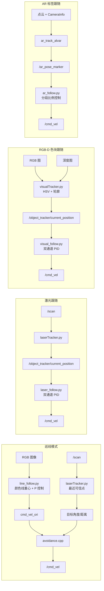

# simple_follower

> [!abstract] 一句话定位
> `simple_follower` 是 ROS 1 下的移动机器人跟随应用包。它把相机、深度图、激光雷达或 AR 标签提供的目标信息转换成 `geometry_msgs/Twist`，最终通过 `/cmd_vel` 控制底盘。

## 1. 仓库位置与学习目标

- 仓库路径：`simple_follower/`
- ROS 包名：`simple_follower`
- 构建方式：catkin
- 主要语言：Python（跟踪与控制）、C++（巡线避障）
- 主要功能：巡线、激光跟随、RGB-D 色块跟随、AR 标签跟随
- 推荐运行环境：ROS Melodic/Python 2 风格环境。源码使用了 Python 2 的 `thread` 模块和已经从新版本 Python 中移除的 `time.clock()`，不能直接视为 Python 3 兼容代码。

学习本包时要始终区分两层：

1. **Tracker（感知层）**：从图像或雷达中找出目标，发布目标角度和距离。
2. **Follower（控制层）**：计算目标误差，生成速度并发布 `/cmd_vel`。

巡线模式是一个例外：`line_follow.py` 同时完成颜色检测和巡线控制，再由 `avoidance` 对速度进行雷达避障过滤。

## 2. 四种启动入口总览

| 模式 | 启动文件 | 关键输入 | 中间数据 | 最终输出 |
|---|---|---|---|---|
| 巡线 | `line_follower.launch` | RGB 图像、`/scan` | `cmd_vel_ori`、目标最近点 | `/cmd_vel` |
| 激光跟随 | `laser_follower.launch` | `/scan` | `/object_tracker/current_position` | `/cmd_vel` |
| RGB-D 色块跟随 | `visual_follower.launch` | RGB 图、深度图 | `/object_tracker/current_position` | `/cmd_vel` |
| AR 标签跟随 | `ar_follower.launch` | 点云、相机标定、AR 位姿 | `/ar_pose_marker` | `/cmd_vel` |

```bash
roslaunch simple_follower line_follower.launch
roslaunch simple_follower laser_follower.launch
roslaunch simple_follower visual_follower.launch
roslaunch simple_follower ar_follower.launch
```

> [!warning] 真机安全
> 四个启动文件都会启动底盘，且多个程序可直接发布 `/cmd_vel`。第一次实验应架空驱动轮或降低速度，并先用 `rostopic info /cmd_vel` 确认只有预期的发布者。

## 3. 构建产物与目录作用

| 路径 | 构建/运行结果 | 说明 |
|---|---|---|
| `msg/position.msg` | `simple_follower/position` | Tracker 与 Follower 间的自定义目标消息 |
| `cfg/arPID.cfg` | `arPIDConfig` | AR 跟随动态参数 |
| `cfg/laser_params.cfg` | `laser_paramsConfig` | 激光跟随动态参数 |
| `cfg/Params_color.cfg` | `Params_colorConfig` | 色块 HSV 动态参数 |
| `cfg/Params_PID.cfg` | `Params_PIDConfig` | 视觉跟随 PID 动态参数 |
| `src/avoidance.cpp` | `avoidance` | 巡线速度的雷达避障过滤节点 |
| `src/obs_avo.cpp` | `obs_avo` | 基于里程计方向判断的实验性避障节点，默认不启动 |
| `scripts/*.py` | Python ROS 节点或辅助程序 | 需要脚本具有可执行权限 |

### 自定义消息 `position.msg`

```text
float32 angleX
float32 angleY
float32 distance
```

| 字段 | 激光模式 | 视觉模式 |
|---|---|---|
| `angleX` | 雷达最近目标的水平角，单位 rad | 色块中心相对相机光轴的水平角，单位 rad |
| `angleY` | 固定写入 `42`，无实际控制意义 | 色块中心的垂直角，单位 rad，但控制器未使用 |
| `distance` | 雷达距离，单位 m | 深度图均值，源码按 mm 使用 |

> [!important] 同一消息、不同单位
> `distance` 没有在消息定义中注明单位。激光链路使用米，视觉链路使用毫米，不能把两个 Follower 混接。

## 4. 依赖关系

### 4.1 `package.xml` 已声明的依赖

- 构建工具：`catkin`
- 消息生成：`message_generation`、`message_runtime`
- ROS C++/Python：`roscpp`、`rospy`
- 消息包：`std_msgs`、`sensor_msgs`、`geometry_msgs`

### 4.2 源码和 launch 实际还依赖

| 依赖 | 被谁使用 | 用途 |
|---|---|---|
| `dynamic_reconfigure` | 4 个 `cfg`、三个跟随/跟踪节点 | 运行时在线调 PID、速度和 HSV 阈值 |
| `cv_bridge` | `line_follow.py`、`visualTracker.py` | ROS 图像与 OpenCV 图像转换 |
| `message_filters` | `visualTracker.py` | 近似同步 RGB 图和深度图 |
| OpenCV / `cv2` | 巡线、视觉跟踪、阈值工具 | HSV 分割、形态学处理、轮廓和 GUI |
| NumPy | 多个 Python 节点 | 数组、均值、排序、PID 和限幅 |
| Matplotlib | `visualTracker.py` | 可选调试显示；当前 `displayImage=False` |
| `ar_track_alvar` | `ar_follower.launch` | 运行 `individualMarkers` 标签检测节点 |
| `ar_track_alvar_msgs` | `ar_follow.py` | 接收 `AlvarMarkers` |
| `nav_msgs` | `obs_avo.cpp` | 接收 `/odom`；当前 CMake/package 未声明 |
| `turn_on_wheeltec_robot` | 四个顶层 launch | 启动底盘、相机、雷达及机器人模型 |
| 相机驱动 | 视觉、巡线、AR | 默认通过 `wheeltec_camera.launch` 选择 `astra_camera` 或 `usb_cam` |
| 雷达驱动 | 激光跟随、巡线避障 | 通过 `wheeltec_lidar.launch` 选择实际雷达驱动 |

> [!bug] 元数据不完整
> `CMakeLists.txt` 查找了 `dynamic_reconfigure`，但 `package.xml` 未声明它；`cv_bridge`、`message_filters`、`ar_track_alvar_msgs`、`nav_msgs` 和外部启动包也没有完整写入 `package.xml`。因此仅执行 `rosdep install --from-paths src` 不一定能安装全部运行依赖。

### 4.3 硬件与上游话题要求

| 功能 | 必须存在的上游数据 |
|---|---|
| 巡线 | `/camera/rgb/image_raw`；六轴机械臂车型时使用 `/usb_cam/image_raw`；另需 `/scan` 做避障 |
| 激光跟随 | `/scan`，类型 `sensor_msgs/LaserScan` |
| 视觉跟随 | `/camera/rgb/image_raw` 与 `/camera/depth/image_raw`，分辨率参数默认均为 640×480 |
| AR 跟随 | `/camera/depth_registered/points` 和 `/camera/rgb/camera_info`，由 `ar_track_alvar` 生成 `/ar_pose_marker` |

## 5. 节点与接口总表

| 节点名 | 可执行程序 | 订阅 | 发布 | 启动模式 |
|---|---|---|---|---|
| `/opencv` | `line_follow.py` | RGB 图像 | `cmd_vel_ori` (`Twist`) | 巡线 |
| `/avoidance` | `avoidance` | `cmd_vel_ori`、`/object_tracker/current_position` | `cmd_vel` (`Twist`) | 巡线 |
| `/laser_tracker` | `laserTracker.py` | `scan` (`LaserScan`) | `object_tracker/current_position`、`object_tracker/info` | 巡线、激光 |
| `/follower` | `laser_follow.py` | `/object_tracker/current_position`、`/object_tracker/info` | `/cmd_vel`、`/laser_follow_flag` | 激光 |
| `/visual_tracker` | `visualTracker.py` | RGB 图、深度图 | `/object_tracker/current_position`、`/visual_follow_flag` | 视觉 |
| `/follower` | `visual_follow.py` | `/object_tracker/current_position`、`/object_tracker/info` | `/cmd_vel` | 视觉 |
| `/ar_track_alvar` | `ar_track_alvar/individualMarkers` | 点云、相机标定 | `/ar_pose_marker` 等 | AR |
| `/ar_follower` | `ar_follow.py` | `/ar_pose_marker` | `/cmd_vel` | AR |
| `/obs_avo` | `obs_avo` | `/object_tracker/current_position`、`/odom`、`imu` | `cmd_vel` | 默认不启动 |

`laser_follow.py` 与 `visual_follow.py` 使用相同节点名 `/follower`，不应同时启动；否则后启动的同名节点会令先启动的节点退出。

## 6. 总体数据流



## 7. 巡线模式运行过程

### 7.1 launch 展开

`line_follower.launch` 依次包含或创建：

1. `turn_on_wheeltec_robot/launch/wheeltec_camera.launch`，并传入 `if_usb_cam=true`。
2. `line_tracker`，执行 `line_follow.py`。
3. `avoidance`，执行编译后的 C++ 程序。
4. `turn_on_wheeltec_robot.launch`，启动底盘和相关 TF/里程计节点。
5. `wheeltec_lidar.launch`，启动所选雷达。
6. `laserTracker.launch`，把 `/scan` 转换为最近障碍物位置。

### 7.2 `line_follow.py`：图像到原始巡线速度

初始化过程：

1. 创建 `CvBridge`。
2. 读取全局参数 `/if_six`，默认值为字符串 `no`。
3. `/if_six=yes` 时订阅 `/usb_cam/image_raw`，`no` 时订阅 `/camera/rgb/image_raw`。
4. 创建 `cmd_vel_ori` 发布者。

每收到一帧图像：

1. 首帧创建 `Adjust_hsv` OpenCV 窗口和颜色选择滑块。
2. 把 ROS 图像转成 BGR，并缩放到 320×240。
3. 转为 HSV，先腐蚀再膨胀，降低小噪点影响。
4. 按滑块选择红、绿、蓝、黄或黑色阈值，生成二值 mask。
5. 只保留图像最底部 20 行，计算目标像素的矩。
6. 若找到线，求重心横坐标 `cx`，计算：

   ```text
   erro = cx - 图像宽度/2 - 15
   linear.x  = 0.18
   angular.z = -erro × 0.005
   ```

7. 若没有找到线，线速度和角速度均置零。
8. 发布到 `cmd_vel_ori`，而不是直接发布 `/cmd_vel`。

这里虽然计算了 `d_erro`，但微分系数写成 `0.000`，实际是纯比例转向控制。

### 7.3 `laserTracker.py`：找最近障碍物

处理过程与激光跟随模式相同：

1. 接收本帧 `/scan`，按距离从近到远排序。
2. 对每个候选点，在上一帧相邻 `±winSize` 范围内查找距离差不超过 `deltaDist` 的点。
3. 找到第一个符合条件的点，就认为它是“最近可信物体”。
4. 发布其角度和距离到 `/object_tracker/current_position`。

第一帧没有历史数据，因此不会发布目标位置，只会记录扫描并报告未找到目标。

### 7.4 `avoidance.cpp`：速度门控

`avoidance` 以 30 Hz 运行：

1. 从 `cmd_vel_ori` 保存巡线节点给出的原始速度。
2. 从 `/object_tracker/current_position` 保存最近物体距离与方向。
3. 当距离 `≤0.75 m` 且物体位于当前运动趋势方向时累计计数。
4. 连续超过 5 次后发布一次零 `Twist`。
5. 其他情况下把 `cmd_vel_ori` 原样转发到 `cmd_vel`。

源码对雷达角度的约定是：

- 前进时，把 `angleX > 1.57` 或 `< -1.57` 视为运动方向上的障碍。
- 后退时，把 `-1.57 < angleX < 1.57` 视为运动方向上的障碍。

这说明该仓库的雷达方向/数据排列可能与常见的“0 rad 在车前”不同。更换雷达后必须用 `rostopic echo /scan` 或 RViz 验证角度方向，不能直接照搬阈值。

> [!warning] 避障实现边界
> 计数超过阈值时只发布一次零速度并立即清零计数；障碍仍存在时，接下来几轮不会持续发布零速度。还应确认底盘是否保持上一条零速度，以及是否需要改成持续停车。

## 8. 激光跟随模式运行过程

### 8.1 launch 展开

`laser_follower.launch` 启动：

1. `/laser_tracker`：`laserTracker.py`。
2. `/follower`：`laser_follow.py`。
3. 底盘：`turn_on_wheeltec_robot.launch`。
4. 雷达：`wheeltec_lidar.launch`。

### 8.2 `laserTracker.py`：雷达扫描到目标位置

输入参数：

| 私有参数 | 默认 launch 值 | 作用 |
|---|---:|---|
| `~winSize` | 2 | 在上一帧中检查候选点左右多少个雷达采样 |
| `~deltaDist` | 0.2 m | 两帧之间被认为是同一可信目标的最大距离变化 |

输出逻辑：

- 找到目标：发布 `position(angleX, 42, distance)`。
- 没找到目标：不发布位置，只向 `/object_tracker/info` 发布字符串 `laser:nothing found`。
- 它选择的是**全扫描范围内的最近可信点**，没有聚类、目标身份保持、前方扇区限制或人体识别。因此桌腿、墙角等都可能成为跟随目标。

### 8.3 `laser_follow.py`：位置误差到速度

初始化时读取：

- `~maxSpeed=0.6`
- `~targetDist=0.9 m`
- `~PID_controller`：来自 `PID_laser_param.yaml`
- `~switchMode`、`~controllButtonIndex`：保留的手柄参数，当前 Joy 订阅和 active 判断都被注释，不参与启停。

每次收到目标位置：

1. 读取 `angleX` 和 `distance`。
2. 对角度执行 `angleX ± π` 变换，反映仓库中雷达朝向的特殊约定。
3. PID 目标为 `[0 rad, targetDist]`，输入为 `[angleX, distance]`。
4. 角度和距离误差绝对值小于 `0.1` 时进入死区。
5. 分别计算角速度与线速度，并限制在 `[-maxSpeed, maxSpeed]`。
6. 发布 `/cmd_vel`。
7. 收到约 11 次位置更新后，向 `/laser_follow_flag` 发布一次 `std_msgs/Int8(data=1)`，用于其他语音流程判断功能已经运行。

动态调参入口：

```bash
rosrun rqt_reconfigure rqt_reconfigure
```

可在线修改 `maxSpeed`、`targetDist`、`P_v/P_w`、`I_v/I_w`、`D_v/D_w`。

> [!danger] 目标丢失策略
> `laserTracker.py` 丢失目标时只发布 `/object_tracker/info`；`laser_follow.py` 的信息回调只打印日志，不发布零速度，也没有基于目标消息时间戳的超时停车。因此在收到过非零速度后目标突然消失，源码层面不能保证立即停车。

## 9. RGB-D 色块跟随运行过程

### 9.1 launch 展开

`visual_follower.launch` 启动：

1. 深度相机：`wheeltec_camera.launch`。
2. `/visual_tracker`：`visualTracker.py`。
3. `/follower`：`visual_follow.py`。
4. 底盘：`turn_on_wheeltec_robot.launch`。

### 9.2 `visualTracker.py`：RGB-D 图像到目标位置

初始化：

1. 创建 `Params_colorConfig` 动态调参服务。
2. 读取红、蓝、绿、黄四组 HSV 阈值。
3. 读取图像宽高、相机水平/垂直视角和目标距离。
4. 用 `ApproximateTimeSynchronizer(queue=10, slop=0.5 s)` 同步 RGB 图与深度图。

每对同步图像的处理流程：

1. 强制检查 RGB 消息编码必须为 `rgb8`，否则抛出异常。
2. 检查图像尺寸必须等于参数中的 640×480。
3. RGB 转 HSV，进行腐蚀、膨胀和 `inRange` 颜色分割。
4. 提取外轮廓并选择面积最大的轮廓。
5. 用最小外接旋转矩形求色块中心。
6. 在色块中心附近截取深度区域，忽略 NaN 后求平均深度。
7. 根据像素中心相对画面中心的偏移和相机视角计算 `angleX/angleY`。
8. 发布 `position(angleX, angleY, averageDistance)`。

没有检测到轮廓时，节点发布：

```text
position(angleX=0, angleY=0, distance=targetDist)
```

这会让下游控制误差为零，从而停车。该策略只覆盖“没有轮廓”；深度区域为空或数值异常时的处理并不完整。

动态颜色选项：`Dynamic`、`Red`、`Blue`、`Green`、`Yellow`。源码变量 `targetUpper/targetLower` 的命名与 `cv2.inRange(lower, upper)` 的语义相反：实际数组内容第一组是下界，第二组是上界，阅读时不要被变量名误导。

> [!bug] 深度合法性判断无效
> 源码条件为 `averageDistance > 400 or averageDistance < 3000`。对几乎所有有限数值该条件都为真，因此并没有真正把深度限制在 400～3000 的有效范围内。

### 9.3 `visual_follow.py`：视觉目标到速度

PID 目标：

- 水平角目标：`0 rad`
- 距离目标：`600 mm`

控制过程：

1. 接收 `/object_tracker/current_position`。
2. 计算 `error = [0, targetDist] - [angleX, distance]`。
3. 角度误差 `<0.1 rad`、距离误差 `<100 mm` 时置零。
4. PID 得到角速度、线速度控制量。
5. 两者都限制到 `[-maxSpeed, maxSpeed]`，默认 `0.6`。
6. 发布 `/cmd_vel`。

`Params_PID.cfg` 的视觉线速度 PID 参数在动态回调中会除以 1000，以适配毫米单位；角速度参数不除以 1000。

启动时创建的 1 秒 `controllerLossTimer` 原本用于 Joy 手柄掉线停车，但 Joy 订阅已经注释。它只会在启动约 1 秒后触发一次零速度，不是目标丢失看门狗。

## 10. AR 标签跟随运行过程

### 10.1 launch 展开

`ar_follower.launch` 启动：

1. `/ar_follower`，加载 `parameters/ar_param.yaml`。
2. 深度相机。
3. `/ar_track_alvar`，执行 `individualMarkers`。
4. 底盘。

`ar_track_alvar` 默认参数：

| 参数 | 默认值 |
|---|---:|
| `marker_size` | 7 |
| `max_new_marker_error` | 0.08 |
| `max_track_error` | 0.2 |
| `camera_image` 重映射 | `/camera/depth_registered/points` |
| `camera_info` 重映射 | `/camera/rgb/camera_info` |
| `output_frame` | `camera_link` |

### 10.2 `ar_follow.py`：标签位姿到速度

1. 订阅 `/ar_pose_marker`。
2. 若存在多个标签，只选择 `msg.markers[0]`，没有按 marker ID 筛选。
3. 使用标签 `position.x` 作为前后距离，`position.y + 0.06` 作为左右偏差。
4. 以 `goal_x=0.6 m`、`goal_y=0` 为目标，按前/后、左/右四种情况使用不同的比例和补偿量。
5. 对极低速度设置死区，并做最大速度限制。
6. 回调只更新 `self.move_cmd`；主循环以固定 10 Hz 持续发布最新速度。
7. 标签数组为空时，将线速度和角速度立即清零。

动态参数由 `arPID.cfg` 提供，包括前后线速度比例、左右角速度比例、补偿参数、最大/最小速度和目标位置。

需要注意：

- YAML 中虽然有 `rate: 10`，源码没有读取它，循环频率直接写死为 10 Hz。
- `min_linear_speed` 和 `min_angular_speed` 会被读取和动态更新，但控制计算没有使用它们。
- `shutdown()` 会发布零速度，但没有通过 `rospy.on_shutdown()` 注册；正常丢标时仍会在回调里清零。
- 动态调参服务创建后，源码又用硬编码值覆盖了部分初始比例参数；第一次在线修改后才完全以动态参数为准。

## 11. 其他程序

### `obs_avo.cpp`

这是编译生成但没有被任何本包 launch 启动的实验性避障程序：

- 从 `/object_tracker/current_position` 获取最近障碍物。
- 从 `/odom` 获取实际线速度方向。
- 订阅 `imu`，但当前方向判断没有启用加速度分支。
- 障碍距离 `≤0.75 m` 且位于实际运动方向时向 `cmd_vel` 发布零速度。

它不会转发正常运动命令，只会额外发布零速度，因此若与其他 `/cmd_vel` 发布者并存，会形成多发布者竞争。循环内局部变量 `i` 每次都从 0 开始，所谓“连续发布 50 次”的逻辑实际不会发生。

### `HSV_Threshold.py`

独立 OpenCV 阈值调试工具，不是 ROS 节点：

- 直接打开 `/dev/video0` 对应的摄像头。
- 用滑块调节三个通道阈值和形态学核大小。
- 按大写 `Q` 退出。

文件名叫 HSV，程序也先把图像转成 HSV，但滑块仍命名为 R/G/B，实际调的是 H/S/V 三通道。末尾写成 `cameraCapture.release` 而非 `cameraCapture.release()`，设备释放调用存在错误。

### `testCode.py`

这是旧版单元测试草稿，引用了仓库中不存在的 `unsafe_runaway` 模块和 `simpleTracker`，也没有接入 CMake 的测试目标，当前不能直接作为有效测试运行。

### `eye.xml`、`face.xml`

两个 OpenCV Haar 分类器数据文件。当前 `simple_follower` 源码没有加载它们，应视为遗留资源。

## 12. 参数速查

### 激光 Tracker

| 参数 | 默认值 | 影响 |
|---|---:|---|
| `~winSize` | 2 | 越大越容易在邻近角度找到上一帧匹配点 |
| `~deltaDist` | 0.2 m | 越大越能容忍目标快速移动，也越易接受噪点 |

### 激光 Follower

| 参数 | 默认值 | 影响 |
|---|---:|---|
| `~maxSpeed` | 0.6 | 线速度与角速度共同的绝对上限 |
| `~targetDist` | 0.9 m | 期望跟随距离 |
| `P` | `[1.6, 0.5]` | 角度、距离两个通道的比例参数 |
| `I` | `[0, 0]` | 积分参数 |
| `D` | `[0, 0]` | 微分参数 |

### 视觉 Follower

| 参数 | 默认值 | 影响 |
|---|---:|---|
| `~maxSpeed` | 0.6 | 线速度与角速度共同上限 |
| `~targetDist` | 600 mm | 期望跟随距离 |
| `P` | `[1.4, 0.4]` | 角度和距离比例参数；距离通道运行时除以 1000 |
| `I` | `[0, 0]` | 积分参数 |
| `D` | `[0.03, 0]` | 微分参数 |

### AR Follower

| 参数 | YAML/动态默认值 | 是否实际使用 |
|---|---:|---|
| `goal_x` | 0.6 m | 是 |
| `goal_y` | 0 | 是 |
| `max_linear_speed` | 0.2 | 是 |
| `max_angular_speed` | 0.5 | 是 |
| `min_linear_speed` | -0.2 | 否 |
| `min_angular_speed` | -0.5 | 否 |
| `rate` | 10 | 否，源码固定 10 Hz |

## 13. 启动后的验证顺序

### 通用检查

```bash
rosnode list
rostopic info /cmd_vel
rostopic hz /cmd_vel
rostopic echo /cmd_vel
```

### 巡线

```bash
rostopic hz /camera/rgb/image_raw
rostopic echo /cmd_vel_ori
rostopic echo /object_tracker/current_position
rostopic info /cmd_vel
```

预期：图像回调产生 `cmd_vel_ori`；`avoidance` 是最终 `/cmd_vel` 发布者之一。

### 激光跟随

```bash
rostopic hz /scan
rostopic echo /object_tracker/current_position
rostopic echo /object_tracker/info
rostopic echo /cmd_vel
```

预期：第一帧扫描不发布位置；从第二帧开始，稳定最近点产生角度和距离。

### 视觉跟随

```bash
rostopic hz /camera/rgb/image_raw
rostopic hz /camera/depth/image_raw
rostopic echo /object_tracker/current_position
rosrun rqt_reconfigure rqt_reconfigure
```

预期：RGB 与深度消息时间接近；目标距离通常以毫米量级出现；遮挡色块后位置消息回到 `(0, 0, 600)`。

### AR 跟随

```bash
rostopic hz /camera/depth_registered/points
rostopic echo /ar_pose_marker
rostopic echo /cmd_vel
```

预期：能看到标签时 `markers` 非空；移走标签后 `/cmd_vel` 在约一个回调周期内变为零。

## 14. 常见故障定位

| 现象 | 优先检查 |
|---|---|
| Python 报 `No module named thread` | 是否误用 Python 3 运行 Python 2 风格节点 |
| 报 `time.clock` 不存在 | Python 版本过新；源码尚未迁移到 `time.perf_counter/process_time` |
| 找不到 `*Config` | 是否重新 `catkin_make` 并 `source devel/setup.bash`，`dynamic_reconfigure` 是否安装 |
| 找不到 `simple_follower.msg` | 自定义消息是否成功生成，工作空间是否 source |
| 视觉节点提示编码不是 `rgb8` | 相机实际编码与源码强校验不一致 |
| 视觉节点提示 shape 不对 | 相机分辨率不是参数指定的 640×480 |
| 视觉能识别但距离为 NaN | 色块区域没有有效深度，检查 RGB/Depth 对齐与目标材质 |
| 激光跟随对象选错 | 算法只选择全局最近可信点；清除近处杂物或增加角度/聚类约束 |
| 目标丢失后车仍动 | 激光 Follower 没有目标超时停车机制，应先人工急停 |
| `/cmd_vel` 行为跳变 | 检查是否有多个发布者，尤其 `obs_avo`、导航、遥控与跟随节点 |
| AR 检测不到标签 | 检查标签尺寸单位、相机信息、注册点云话题与 `output_frame` |
| 巡线转向方向相反 | 检查相机镜像、`angular.z` 符号和车型底盘坐标约定 |

## 15. 源码层面的重要结论

1. 激光 Tracker 不是“跟人算法”，只是跨两帧验证后的最近点选择器。
2. 激光跟随在目标消失时没有可靠的自动停车机制。
3. 视觉跟随用毫米，激光跟随用米，但共用同一种 `position` 消息。
4. 巡线速度必须经过 `avoidance` 才到 `/cmd_vel`；单独运行 `line_follow.py` 只会发布 `cmd_vel_ori`。
5. 巡线颜色由本机 OpenCV GUI 滑块选择，需要图形桌面环境。
6. AR 跟随只选择消息中的第一个标签，不保证锁定固定 ID。
7. 多个模式共用 `/object_tracker/current_position` 和 `/cmd_vel`，不能无隔离地同时运行。
8. `package.xml` 的依赖声明落后于实际源码依赖。
9. 本包没有使用 TF 做目标坐标变换，控制结果依赖传感器安装方向和上游坐标约定。
10. 除 AR 丢标和视觉无轮廓外，多数安全停止策略不够完整，真机需要额外急停或速度仲裁。

## 16. 推荐阅读顺序与实验

### 阅读顺序

1. `msg/position.msg`：先理解感知与控制的接口。
2. 四个顶层 launch：明确每种模式到底启动哪些上游设备和节点。
3. `laserTracker.py` → `laser_follow.py`：最清楚的 Tracker/Follower 分层例子。
4. `visualTracker.py` → `visual_follow.py`：加入图像同步、颜色分割和深度单位。
5. `line_follow.py` → `avoidance.cpp`：理解速度过滤链。
6. `ar_follow.py`：理解直接使用外部位姿消息的单节点控制。
7. 四个 `cfg` 与三个 YAML：把源码变量和在线调参项对应起来。

### 实验清单

- [ ] 能够编译并生成 `simple_follower/position` 和四组动态配置。
- [ ] 分别启动四种模式，记录实际节点列表。
- [ ] 用 `rostopic info /cmd_vel` 确认发布者数量。
- [ ] 验证雷达的 0 rad 方向与顺/逆时针定义。
- [ ] 记录激光目标的 `angleX`、`distance` 与输出速度。
- [ ] 遮挡视觉目标，确认输出位置回到目标设定点并停车。
- [ ] 移走激光目标，实测旧速度是否仍被底盘保持。
- [ ] 调整 HSV 阈值并观察 mask、轮廓稳定性和深度值。
- [ ] 调整 `targetDist`，比较稳态距离与振荡情况。
- [ ] 测试 AR 多标签场景，确认 `markers[0]` 是否稳定。

## 17. 关联笔记

- [[分类/04-跟随与自主行为]]
- [[04-系统数据流]]
- [[功能包/turn_on_wheeltec_robot]]

