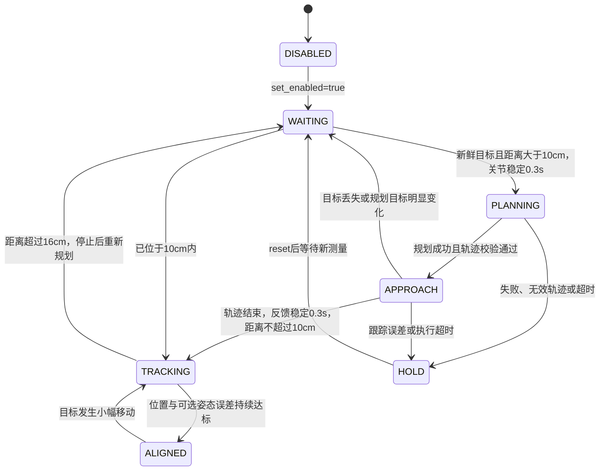

# 长距离规划＋近距离视觉伺服

`aubo_visual_servo_node` 增加可选混合模式。远距离使用分拣系统同一套
MoveIt/OMPL 规划组 `aubo_i5`，近距离使用现有 PBVS；两个阶段统一通过
`CommandQueue` 输出到 Gazebo 位置控制器或 SDK TCP2CANBUS。MoveIt 仅计算
轨迹，不执行轨迹，也不接管控制器。默认 `hybrid_enabled=false`，保留原有入口行为。

## 启动

眼在手外仿真：

```bash
roslaunch aubo_ros_control eye_to_hand_hybrid_control_gazebo.launch auto_start:=true
```

眼在手上仿真：

```bash
roslaunch aubo_ros_control eye_in_hand_hybrid_control_gazebo.launch auto_start:=true
```

专用入口默认开启混合控制，不需要再传 `hybrid_enabled`：

| 相机安装 | 仿真入口 | 真机入口 |
|---|---|---|
| 眼在手上 | `eye_in_hand_hybrid_control_gazebo.launch` | `eye_in_hand_hybrid_control_real.launch` |
| 眼在手外 | `eye_to_hand_hybrid_control_gazebo.launch` | `eye_to_hand_hybrid_control_real.launch` |

四个入口均可用 `hybrid_config:=/absolute/path/custom.yaml` 替换混合参数，
并透传对应原入口的相机、感知、目标和场景参数。原 `*_visual_servo_*.launch`
仍支持 `hybrid_enabled:=true`。

两个真机专用入口使用原有相机标定、
机器人地址和 SDK 配置。`auto_start` 默认仍为 false。启动入口自动加载与相机
安装一致的 SRDF，并设置 MoveIt `allow_trajectory_execution=false`。
不要同时启动原分拣节点的机械臂运动、轨迹控制器或 `aubo_hw_node`；混合节点
是此模式下唯一的关节指令生产者。

已有机器人环境可单独包含 `visual_servo_core.launch`，传入 `hybrid_enabled=true`
与原来的 `mode_config/backend`。此时上层还需提供 `/plan_kinematic_path`、
机器人模型、关节反馈和 TF。可用 `hybrid_config` 指定自定义混合参数文件。

## 控制流程



控制器先从关节反馈计算 TCP 正运动学。眼在手外的期望 TCP 位置为目标基坐标
位置加 `target_offset`，姿态沿用 `desired_target_rpy`。眼在手上则从当前 TCP
位姿和观测目标相对位姿恢复目标，使用 `desired_target_position/rpy` 求期望 TCP
位姿。未启用姿态控制时，规划保持当前 TCP 朝向。

远距离规划终点位于当前 TCP 至期望 TCP 连线上，距期望位置默认 6 cm；最终
朝向已在规划阶段完成。规划开始状态来自当前实测关节，返回轨迹按关节名称重排，
检查时间严格递增、有限数值、关节位置/分段速度限制、起点一致性和 FK 终点。
轨迹按时间做关节线性插值，每次只向队列加入一个控制周期的点，不能整条路径
预装入控制柜。执行结束必须以反馈确认到位，不能仅凭计划时间切换。

近距离误差生成基坐标系下的线速度与角速度 `v = [Kp ep; Kr eR]`，其中姿态误差
使用旋转矩阵对数，并经过笛卡尔速度限制。KDL 提供 TCP 雅可比 `J(q)`：

```text
q_dot = Jᵀ (J Jᵀ + λ² I)⁻¹ v
q_dot_limited = 限关节速度、限关节加速度(q_dot)
q_cmd[k+1] = 限关节位置(q_cmd[k] + q_dot_limited Δt)
CommandQueue.push(q_cmd[k+1])
```

沿用反馈混合纠偏避免积分漂移。混合模式的速度软死区取位置到达容差的一半，
使误差能够进入到达窗口，而不会在窗口边界外渐近停滞。`ALIGNED` 使用原来的
保持时间和释放迟滞，目标微移后可以再次闭环修正。

## 关键参数

见 `config/hybrid_control.yaml`。距离均为 TCP 到期望 TCP 的位置误差，不是相机深度。

| 参数 | 默认 | 含义 |
|---|---:|---|
| hybrid_enter_distance | 0.10 m | 进入局部视觉控制的范围 |
| hybrid_exit_distance | 0.16 m | 离开局部控制、停止后重规划的范围 |
| hybrid_standoff | 0.06 m | 规划终点与最终目标位置的距离 |
| hybrid_target_drift | 0.04 m | 规划/接近过程中目标变化超过此值，丢弃旧规划 |
| hybrid_joint_error | 0.08 rad | 最大单关节轨迹跟踪误差 |
| hybrid_planning_time | 3 s | MoveIt 允许规划时间，额外 2 s 后看门狗锁存 HOLD |
| hybrid_execution_timeout | 30 s | 轨迹执行与到位等待的总超时 |
| command_queue_capacity | 8 点 | 软件队列上限 |
| sdk_mac_buffer_target | 24 标量 | 六关节约 4 个点的控制柜前向缓存目标 |

规划或接近期间，启用姿态控制时目标姿态变化超过 0.15 rad 也会触发停止重规划。
目标过期或丢失时立即清理软件队列并提交反馈保持点；混合模式不盲目搜索或滑行。
关节反馈超时、规划失败、非法轨迹和跟踪偏差锁存 HOLD，需调用
`/visual_servo/reset` 或重新启用。停用/复位会递增规划版本号，异步旧回包不能恢复运动。

接口继续使用 `/visual_servo/target_pose` (`PoseStamped`)、
`/visual_servo/state`、`/visual_servo/set_enabled` 和 `/visual_servo/reset`。
分拣任务若使用此控制流程，应将选定的同一物体持续转换为目标位姿消息，等待
`ALIGNED` 后衔接夹爪操作；此改动提供机械臂混合接近与对准，不自动选择物体或触发夹爪。

## 验证与边界

```bash
catkin_make --pkg aubo_ros_control
catkin_make run_tests_aubo_ros_control
catkin_test_results
```

`test/hybrid_control.test` 启动实际控制节点、六关节测试模型、模拟规划服务与位置
反馈，检查远近切换、在线目标修正、视觉丢失保持、规划失败、非有限轨迹、关节名称
重排、停用后迟到回包、规划超时和反馈中断。该测试不连接机械臂。

开发环境已检查 XML/YAML、启动参数对应关系、测试 Python 语法和差异空白；当前
Windows 环境缺少可用 ROS/catkin，尚未执行 C++ 编译、rostest、Gazebo 或真机验收。

MoveIt 的避障以其规划场景为准，需将工作台和障碍物加入场景。近距离 PBVS 沿用
现有局部控制器，不含在线碰撞检测；应在已验证的局部自由空间内运行。规划轨迹
经过关节线性插值及输出端限速/限加速度，实机路径仍需验证。清空软件队列不能撤销
已经进入控制柜 FIFO 的点，停止存在缓存与制动延迟，不能代替硬件急停。
