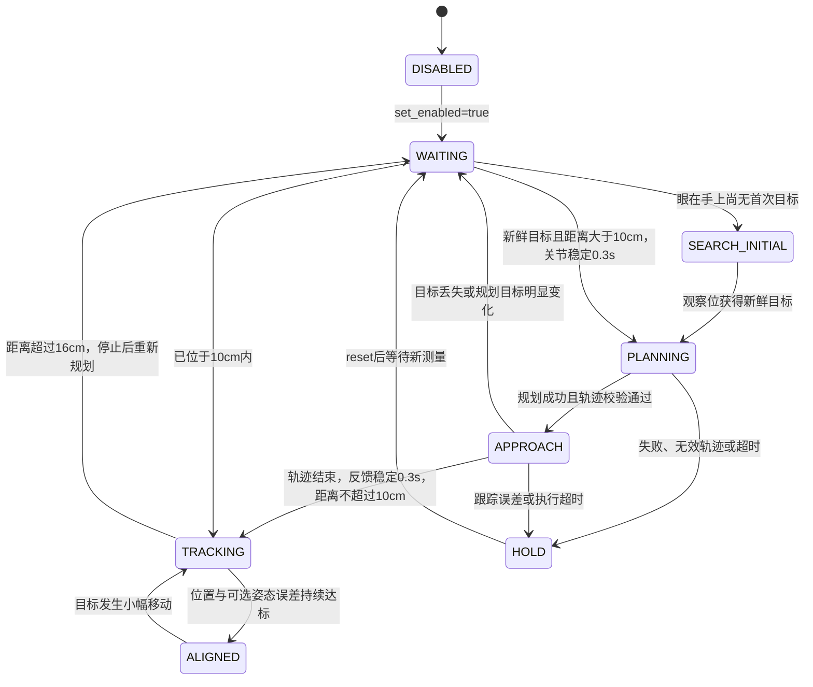

# 长距离规划＋近距离视觉伺服

hybrid 组合入口位于 `aubo_sorting/launch`，使用 `roslaunch aubo_sorting ...`；
它们包含 `aubo_ros_control/launch` 下对应的 `eye_...visual_servo...` 入口。
底层 `visual_servo_core.launch`、控制节点、配置与相机入口仍由 `aubo_ros_control` 提供。

`aubo_visual_servo_node` 增加可选混合模式。远距离使用分拣系统同一套
MoveIt/OMPL 规划组 `aubo_i5`，近距离使用现有 PBVS；两个阶段统一通过
`CommandQueue` 输出到 Gazebo 位置控制器或 SDK TCP2CANBUS。MoveIt 仅计算
轨迹，不执行轨迹，也不接管控制器。默认 `hybrid_enabled=false`，保留原有入口行为。

## 启动

眼在手外仿真：

```bash
roslaunch aubo_sorting eye_to_hand_hybrid_control_gazebo.launch auto_start:=true
```

眼在手上仿真：

```bash
roslaunch aubo_sorting eye_in_hand_hybrid_control_gazebo.launch auto_start:=true
```

专用入口默认开启混合控制，不需要再传 `hybrid_enabled`：

| 相机安装 | 仿真入口 | 真机入口 |
|---|---|---|
| 眼在手上 | `eye_in_hand_hybrid_control_gazebo.launch` | `eye_in_hand_hybrid_control_real.launch` |
| 眼在手外 | `eye_to_hand_hybrid_control_gazebo.launch` | `eye_to_hand_hybrid_control_real.launch` |

四个入口均可用 `hybrid_config:=/absolute/path/custom.yaml` 替换混合参数，
并透传对应原入口的相机、感知、目标和场景参数。原 `*_visual_servo_*.launch`
仍支持 `hybrid_enabled:=true`。

两个真机专用入口使用原有相机标定、
机器人地址和 SDK 配置。`auto_start` 默认仍为 false。启动入口自动加载与相机
安装一致的 SRDF，并设置 MoveIt `allow_trajectory_execution=false`。
不要同时启动原分拣节点的机械臂运动、轨迹控制器或 `aubo_hw_node`；混合节点
是此模式下唯一的关节指令生产者。

已有机器人环境可单独包含 `visual_servo_core.launch`，传入 `hybrid_enabled=true`
与原来的 `mode_config/backend`。此时上层还需提供 `/plan_kinematic_path`、
机器人模型、关节反馈和 TF。可用 `hybrid_config` 指定自定义混合参数文件。

Gazebo 混合入口会自动把 `aubo_sorting/config/sorting.yaml` 中的工作台注册为
MoveIt 碰撞物体，并通过 `/hybrid/planning_scene_ready` 发布确认状态。碰撞场景
尚未就绪时控制器只保持当前位置，RViz 面板也不会允许启动流程。Gazebo 世界模型
不会自动出现在 MoveIt 中，因此自定义 world 时必须同步修改上述桌面参数。

## 控制流程



控制器先从关节反馈计算 TCP 正运动学。感知目标是物体**可见顶面**；混合分拣
的期望 TCP 必须是抓取位，而不是普通视觉伺服的观察距离或避让偏置。
两种相机安装方式均先把顶面点换算到基坐标系，再沿基坐标 Z 加
`hybrid_surface_to_grasp_z = -object_height/2 + grasp_height_offset`。
当前 4 cm 方块和 1 cm 抓取补偿对应 `-0.01 m`。MoveIt 规划、远近切换、
目标漂移判断和近距离 PBVS 共用此抓取位；普通模式仍使用原来的
`desired_target_position` 或 `target_offset`。更换物体高度时须同步标定该偏移。
混合模式可通过 `hybrid_use_orientation_control` 和基坐标系下的
`hybrid_desired_tcp_rpy` 固定 TCP 姿态；默认 `[pi, 0, 0]` 使工具 Z 轴竖直向下。
该姿态在 MoveIt 接近和近距离 PBVS 两阶段共用。未启用时，规划保持当前 TCP 朝向。

混合分拣的远距离规划终点在抓取 TCP 正上方 6 cm，形成垂直预抓取位；
近距离 PBVS 从该位置沿目标误差闭环下降。这样不会沿观察位到抓取位的任意斜线
把腕部相机带到夹爪后方。关闭 `hybrid_vertical_approach` 时保留沿当前 TCP
到目标连线退开 6 cm 的通用模式。最终
朝向已在规划阶段完成。规划开始状态来自当前实测关节，返回轨迹按关节名称重排，
检查时间严格递增、有限数值、关节位置限制、起点一致性和 FK 终点。
MoveIt 的关节速度/加速度限制与伺服输出限制保持一致，规划使用 0.5 缩放系数预留
跟踪余量；若时间参数仍超过预算，控制器保留避障路径并自动拉伸时间。仅有起点和
终点的稀疏轨迹使用零端点速度平滑插值；含 MoveIt 时间参数化中间点的轨迹连续通过，
避免在每个采样点人为停下。每次只向队列加入一个控制周期的点，不能整条路径预装入
控制柜。执行结束必须以反馈确认到位，不能仅凭计划时间切换。

近距离误差生成基坐标系下的线速度与角速度 `v = [Kp ep; Kr eR]`，其中姿态误差
使用旋转矩阵对数，并经过笛卡尔速度限制。KDL 提供 TCP 雅可比 `J(q)`：

```text
q_dot = Jᵀ (J Jᵀ + λ² I)⁻¹ v
q_dot_limited = 限关节速度、限关节加速度(q_dot)
q_cmd[k+1] = 限关节位置(q_cmd[k] + q_dot_limited Δt)
CommandQueue.push(q_cmd[k+1])
```

沿用反馈混合纠偏避免积分漂移。混合模式的速度软死区取位置到达容差的一半，
使误差能够进入到达窗口，而不会在窗口边界外渐近停滞。`ALIGNED` 使用原来的
保持时间和释放迟滞，目标微移后可以再次闭环修正。

## 关键参数

见 `config/hybrid_control.yaml`。距离均为 TCP 到期望 TCP 的位置误差，不是相机深度。

| 参数 | 默认 | 含义 |
|---|---:|---|
| hybrid_enter_distance | 0.10 m | 进入局部视觉控制的范围 |
| hybrid_exit_distance | 0.16 m | 离开局部控制、停止后重规划的范围 |
| hybrid_standoff | 0.06 m | 规划终点与最终目标位置的距离 |
| hybrid_vertical_approach | true | 规划到抓取点正上方的预抓取位 |
| hybrid_target_drift | 0.04 m | 规划/接近过程中目标变化超过此值，丢弃旧规划 |
| hybrid_joint_error | 0.08 rad | 最大单关节轨迹跟踪误差 |
| hybrid_planning_time | 3 s | MoveIt 允许规划时间，额外 2 s 后看门狗锁存 HOLD |
| hybrid_execution_timeout | 60 s | 轨迹执行与到位等待的总超时；应大于安全重定时后的轨迹时长 |
| hybrid_require_scene_ready | true | 未确认工作台碰撞场景时禁止混合运动 |
| hybrid_surface_to_grasp_z | -0.01 m | 顶面点到抓取 TCP 的基座 Z 偏移 |
| hybrid_min_tcp_z | 0.12 m | 局部 PBVS 的 TCP 最低安全高度 |
| hybrid_use_orientation_control | true | 规划和 PBVS 均启用世界系 TCP 姿态控制 |
| hybrid_desired_tcp_rpy | [pi,0,0] | 基坐标系下竖直向下的 TCP 姿态 |
| command_queue_capacity | 8 点 | 软件队列上限 |
| sdk_mac_buffer_target | 24 标量 | 六关节约 4 个点的控制柜前向缓存目标 |

规划或接近期间，启用姿态控制时目标姿态变化超过 0.15 rad 也会触发停止重规划。
眼在手上每次启用或复位后，都会先移动到安装方式配置的
`initial_search_posture`；眼在手外的固定相机不执行该步骤。首次目标已获取后，
目标过期或丢失会立即清理软件队列并提交反馈保持点，不在规划或接近期间盲目回退搜索。
关节反馈超时、规划失败、非法轨迹和跟踪偏差锁存 HOLD，需调用
`/visual_servo/reset` 或重新启用。停用/复位会递增规划版本号，异步旧回包不能恢复运动。

眼在手上混合配置把控制器相机距离保护设为 0.03 m；Gazebo 入口把
感知最小有效深度设为 0.07 m。Gazebo 混合入口将腕部相机侧装在夹爪轴外
10 cm，向腕部后移 8.5 cm，
并使用 110° 水平视场。这样当前方块在抓取位的相机深度约 11 cm，
仍处于相机有效范围内；原安装此时只有约 2.5 cm 深度。仿真混合入口关闭相机坐标中的
目标位置低通滤波，避免接近运动时滤波滞后被误判为物体漂移；控制器仍对
关节速度限幅、滤波。真机入口不改变相机安装和深度能力，须按实际手眼外参、
可见范围及夹爪几何单独校验，不能直接套用仿真近距离配置。
仿真眼在手上入口还锁定已经校验过的 MoveIt 预抓取轨迹：途中短暂遮挡或
局部红色轮廓产生的漂移不会使轨迹反复取消；到预抓取位后仍必须重新看到
有效目标，才允许 PBVS 向抓取位下降。此选项在真机入口默认关闭。
规划或接近中若目标丢失，通常控制器保持并记录原因；若抓取点漂移超过阈值，
停止后重新规划。Gazebo Fuel 的网络报错与这两个状态切换无直接关系；
本仓库的 `ground_plane` 和 `sun` 模型也可以从本地 Gazebo 模型目录加载。
接口继续使用 `/visual_servo/target_pose` (`PoseStamped`)、
`/visual_servo/state`、`/visual_servo/set_enabled` 和 `/visual_servo/reset`。
分拣任务若使用此控制流程，应将选定的同一物体持续转换为目标位姿消息，等待
`ALIGNED` 后衔接夹爪操作；此改动提供机械臂混合接近与对准，不自动选择物体或触发夹爪。

## 验证与边界

```bash
catkin_make --pkg aubo_ros_control
catkin_make run_tests_aubo_ros_control
catkin_test_results
```

`test/hybrid_control.test` 启动实际控制节点、六关节测试模型、模拟规划服务与位置
反馈，检查远近切换、在线目标修正、视觉丢失保持、规划失败、非有限轨迹、关节名称
重排、停用后迟到回包、规划超时和反馈中断。该测试不连接机械臂。

MoveIt 的避障以其规划场景为准；Gazebo 混合入口已自动加入带 2 cm 水平边界和
1 cm 顶部边界的工作台。近距离 PBVS 不做全机械臂在线碰撞查询，因此额外使用
TCP 高度下限保护，但它不能代替完整的连杆碰撞检测；局部段仍应只在桌面上方已验证的
自由空间内运行。规划轨迹
经过分段平滑插值及输出端限速/限加速度，实机路径仍需验证。清空软件队列不能撤销
已经进入控制柜 FIFO 的点，停止存在缓存与制动延迟，不能代替硬件急停。
