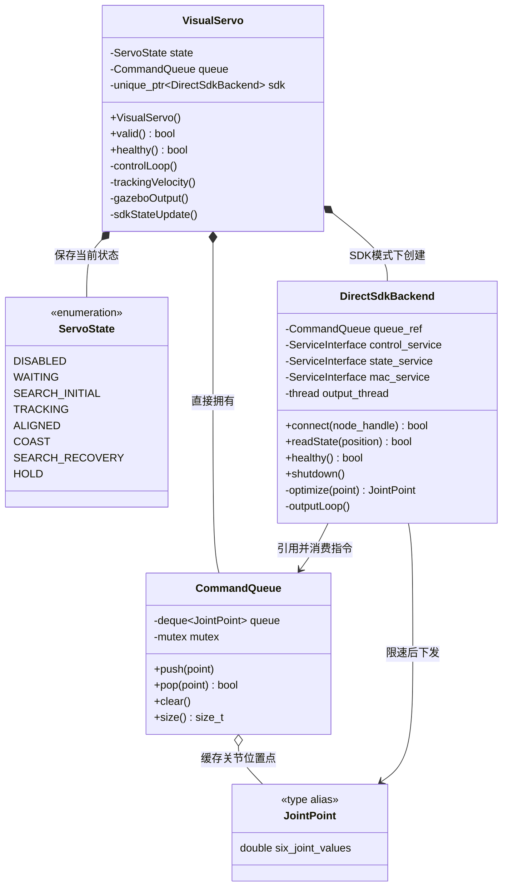
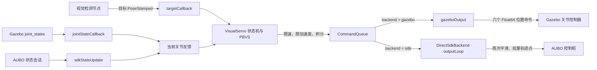

# aubo_ros_control

该功能包为真实 AUBO i5 提供 ROS 1 硬件接口。其实现参考了 [`aubo_ros_control`](https://github.com/2799063570/aubo_perception_planning/tree/main/aubo_ros_control) 的 AUBO SDK 驱动模式，并适配当前工作空间的关节名称和 MoveIt 控制器：`/aubo_i5/aubo_i5_controller/follow_joint_trajectory`。

## 视觉伺服源码结构

视觉伺服虽然分成三个 `.cpp`，但它们最终共同编译成一个可执行节点
`aubo_visual_servo_node`，并不是三个 ROS 节点。拆分的目的是把“控制算法”、
“线程安全队列”和“真机 SDK 通信”三类职责隔离，避免一个源文件同时处理所有细节。

### 文件与类的对应关系

| 实现文件 | 对应头文件 | 主要内容 | 与节点的关系 |
| --- | --- | --- | --- |
| `src/visual_servo.cpp` | `include/aubo_ros_control/visual_servo.h` | `VisualServo` 主控制器、视觉伺服状态机和 `main()` | 包含唯一入口，另外两个文件链接到该节点 |
| `src/visual_servo_common.cpp` | `include/aubo_ros_control/visual_servo_common.h` | `CommandQueue`、`JointPoint` 以及基础数值校验函数 | 节点内部公共工具，不会独立运行 |
| `src/direct_sdk_backend.cpp` | `include/aubo_ros_control/direct_sdk_backend.h` | `DirectSdkBackend` 真机 SDK 执行后端 | `backend:=sdk` 时使用，不会独立运行 |

类的静态关系如下：



### `VisualServo`：主控制器

`VisualServo` 是整个视觉伺服功能的中心类。只有它直接理解视觉目标、TF、机械臂
运动学、状态机以及 Gazebo/SDK 两种执行方式。节点启动时，`main()` 创建一个
`VisualServo` 对象；构造函数完成参数读取、KDL 运动链创建、ROS 话题/服务注册和
后端初始化。

它的职责可以按方法分成五组：

1. **初始化**：`loadParameters()` 读取控制频率、关节限制、视觉模式和丢失策略；
   `initializeKinematics()` 从 `robot_description` 建立 KDL 链；
   `setupGazeboPublishers()` 创建六个 Gazebo 关节控制话题。
2. **接收输入**：`targetCallback()` 接收目标位姿、执行 TF 变换并检查目标是否有效；
   `jointStateCallback()` 接收 Gazebo 关节反馈；`sdkStateUpdate()` 从真机 SDK 读取
   关节位置并发布 ROS `JointState`。
3. **状态管理**：`selectState()` 根据是否启用、目标是否超时和恢复策略选择状态；
   `transitionTo()` 在状态变化时清空旧指令，防止上一状态的命令继续执行。
4. **控制计算**：`trackingVelocity()` 根据位姿误差、KDL 雅可比矩阵和阻尼伪逆
   计算关节速度；`desiredVelocity()` 再根据跟踪、续行或搜索状态选择最终速度；
   `controlLoop()` 负责限速、限加速度、关节限位和位置积分，并把结果写入
   `CommandQueue`。
5. **输出与管理接口**：Gazebo 模式由 `gazeboOutput()` 消费队列并发布六个关节
   位置命令；SDK 模式把队列交给 `DirectSdkBackend`。`setEnabled()` 和 `reset()`
   分别对应 `/visual_servo/set_enabled` 与 `/visual_servo/reset` 服务。

`VisualServo` 内部的 `ServoState` 含义如下：

| 状态 | 含义 | 控制行为 |
| --- | --- | --- |
| `DISABLED` | 控制器未启用 | 保持当前位置 |
| `WAITING` | 已启用，但还没有新目标 | 保持当前位置 |
| `SEARCH_INITIAL` | 第一次看到目标前，移动到初始观察姿态 | 搜索目标 |
| `TRACKING` | 目标新鲜，按视觉误差闭环跟踪 | 闭环运动 |
| `ALIGNED` | 位置/姿态误差持续满足对齐阈值 | 停止积分并保持反馈位置 |
| `COAST` | 目标刚丢失，短时间沿上一速度衰减续行 | 衰减运动 |
| `SEARCH_RECOVERY` | 目标持续丢失，移动到恢复观察姿态 | 恢复搜索 |
| `HOLD` | 停止策略、生效的安全锁存或搜索超时 | 保持当前位置 |

### `CommandQueue`：有界关节指令队列

`CommandQueue` 是控制计算与命令输出之间的线程安全缓冲区，元素类型为
`JointPoint`，也就是六个关节位置组成的 `std::array<double, 6>`。

- `push()` 由 `VisualServo::controlLoop()` 调用，写入最新关节点。
- `pop()` 在 Gazebo 模式由 `VisualServo::gazeboOutput()` 调用，在真机模式由
  `DirectSdkBackend::outputLoop()` 调用。
- 队列达到容量上限时，`push()` 会丢弃最旧的未执行点。视觉伺服更重视最新修正，
  如果保留所有旧点，机械臂会产生越来越大的跟踪延迟。
- `clear()` 在停用、复位和状态切换时清除已经失效的命令。
- 队列内部的互斥量保证 ROS 回调线程与 SDK 输出线程可以安全地同时访问。

`visual_servo_common.cpp` 还提供两个无状态辅助函数：`clampValue()` 将数值限制在
给定区间内，`finitePoint()` 拒绝含 `NaN` 或无穷大的关节指令。它们放在公共文件中，
是因为 `VisualServo` 和 `DirectSdkBackend` 都会使用，并且可以脱离 ROS/SDK 单独测试。

### `DirectSdkBackend`：真机命令执行后端

`DirectSdkBackend` 只负责真实 AUBO 控制柜，不参与视觉误差或雅可比计算。只有参数
`backend:=sdk` 时，`VisualServo` 才会创建它；`backend:=gazebo` 时该对象不存在。

它维护三条用途不同的 SDK 会话：

| SDK 会话 | 作用 |
| --- | --- |
| `control_service_` | 启动机械臂、握手、进入和退出 TCP2CANBUS 模式 |
| `state_service_` | 读取当前关节位置和机器人状态 |
| `mac_service_` | 查询控制柜缓冲区并批量写入轨迹点 |

主要方法的执行关系是：

1. `connect()` 读取连接参数，登录三条会话，确认是真实机械臂且安全状态正常，读取
   初始关节位置，预填静止轨迹，然后进入 TCP2CANBUS 模式并启动 `output_thread_`。
2. `readState()` 从状态会话读取六个关节位置，供 `VisualServo::sdkStateUpdate()`
   更新反馈。
3. `outputLoop()` 在独立线程中持续检查急停、碰撞和控制柜缓冲区；需要新轨迹点时
   从 `CommandQueue` 取出指令，批量发送到控制柜。
4. `optimize()` 在 SDK 消费边界再次执行速度与加速度限制。即使生产端出现调度
   抖动或队列丢弃旧点，发送给真机的关节指令仍保持连续。
5. `shutdown()` 停止输出线程、退出 TCP2CANBUS 模式并注销三条会话；析构函数也会
   调用它，防止节点退出时遗留控制模式。

### 运行时数据流



因此，两种后端的共同部分和差异可以概括为：

```text
视觉目标 + 关节反馈
        │
        ▼
VisualServo（状态机、PBVS、关节约束）
        │
        ▼
CommandQueue（线程安全、有界、只保留较新的修正）
        │
        ├── Gazebo：VisualServo::gazeboOutput() -> ROS 控制话题
        │
        └── 真机：DirectSdkBackend::outputLoop() -> AUBO SDK
```

### 线程和对象生命周期

- `main()` 创建一个 `VisualServo`，然后启动三个 ROS `AsyncSpinner` 工作线程。
- 目标回调、关节反馈回调、控制定时器和输出定时器可能并发执行，所以目标、关节和
  控制状态分别由 `target_mutex_`、`joint_mutex_`、`control_mutex_` 保护。
- `CommandQueue` 有自己的互斥量，不依赖调用者持有上述锁。
- SDK 模式额外创建一个 `DirectSdkBackend::output_thread_`，该线程只负责安全检查和
  向控制柜供点，不重新计算视觉控制量。
- `VisualServo` 生命周期覆盖整个节点；SDK 后端由它独占管理，节点退出时自动清理。

### 推荐阅读顺序

第一次阅读这部分代码时，建议按以下顺序：

1. 先看 `visual_servo.h`，了解 `VisualServo` 的职责、状态和成员分组。
2. 看 `visual_servo.cpp` 的 `main()`、构造函数、`controlLoop()` 和
   `trackingVelocity()`，掌握主控制流程。
3. 看 `visual_servo_common.h/.cpp`，理解 `JointPoint` 与 `CommandQueue`。
4. 调试 Gazebo 时继续看 `gazeboOutput()`；调试真机时再看
   `direct_sdk_backend.h/.cpp`。
5. 参数、启动方式和安全调试流程参见同目录的 `VISUAL_SERVO.md`。

## 使用 rqt_reconfigure 在线调参

启动任一视觉伺服 launch 后，在另一个终端运行：

```bash
source devel/setup.bash
rosrun rqt_reconfigure rqt_reconfigure
```

在左侧选择 `/aubo_visual_servo`。界面按用途分成三组：

- `PBVS_Control`：位置/姿态增益、笛卡尔速度上限、位置死区、阻尼系数和反馈融合；
- `Target_and_Safety`：眼在手上的期望目标位置、眼在手外的 TCP 目标偏移、期望姿态、
  姿态控制开关和最小安全深度；
- `Target_Loss`：目标超时、丢失策略、续行衰减和搜索恢复参数。

参数变化由 `VisualServo::reconfigureCallback()` 在 `control_mutex_` 保护下整体更新，
并清空尚未执行的旧关节点，因此新值从下一控制周期开始参与计算。首次创建动态参数
服务器时会使用 YAML 已加载的实际值，不会用 `.cfg` 默认值覆盖眼在手上/眼在手外
配置。

以下结构参数不会出现在 `rqt_reconfigure` 中，因为修改它们需要重建对象或重新连接
设备：`backend`、`servo_mode`、话题和坐标系、控制/输出频率、关节名称、关节硬限制、
队列容量以及 SDK 地址和登录参数。启停与安全锁存复位仍必须使用
`/visual_servo/set_enabled` 和 `/visual_servo/reset` 服务。

在线修改只写入当前 ROS 参数服务器，不会回写 YAML 文件；节点重启后会重新使用
`config/visual_servo_*.yaml` 中的值。确定一组参数后，应手动同步到对应 YAML。

## 安全机制

- 只有三个 SDK 会话均已连接、控制器确认为真实机器人、启动与握手成功且已进入 TCP2CANBUS 模式后，才接受位置指令。
- 加载控制器前必须成功读取硬件初始关节位置。
- 急停、碰撞或保护性停止、非法数值指令、发送失败或套接字断开都会停止后续指令输出。连接断开后必须检查现场并重启节点，驱动不会自动恢复运动。
- 指令线程会限制每个关节的速度步长，并独立于 ROS 控制循环填充控制器 MAC 缓冲区。

## 编译

```bash
cd ~/catkin_ws
catkin_make --pkg aubo_sdk aubo_ros_control
source devel/setup.bash
```

ROS Melodic 环境若缺少依赖，请安装 `ros-control`、`ros-controllers`、`joint-state-controller` 和 `position-controllers`。

## 运动前验证

先进行 SDK 只读连接测试，该操作不会启动或移动机械臂：

```bash
rosrun aubo_sdk sdk_test 192.168.1.2
```

随后启动仅状态模式。该模式不会调用机器人启动流程，也不会进入 TCP2CANBUS 模式：

```bash
roslaunch aubo_ros_control aubo_state.launch robot_ip:=192.168.1.2
rostopic echo /aubo_i5/joint_states
```

## 真实机械臂控制

执行轨迹前，请确保示教器和急停按钮随时可用、工作区内无人员或障碍物，并核对 RViz 与真实机械臂的关节方向一致。

仅启动硬件控制器：

```bash
roslaunch aubo_ros_control aubo_control.launch robot_ip:=192.168.1.2
```

同时启动硬件、MoveIt、`robot_state_publisher` 和 RViz：

```bash
roslaunch aubo_ros_control aubo_real_bringup.launch robot_ip:=192.168.1.2
```

重要话题和接口：

- 硬件状态：`/aubo_i5/joint_states`
- MoveIt/TF 合并状态：`/joint_states`
- 轨迹动作：`/aubo_i5/aubo_i5_controller/follow_joint_trajectory`
- 控制器管理器：`/aubo_i5/controller_manager`

`server_port`、登录凭据、碰撞等级、指令平滑和控制频率等参数均由 `aubo_control.launch` 暴露，不在代码中写死。

真实机械臂启动文件默认使用 `aubo_i5_with_camera.xacro`。若不加载手眼相机，可执行：

```bash
roslaunch aubo_ros_control aubo_real_bringup.launch \
  robot_ip:=192.168.1.2 \
  robot_xacro:=aubo_i5.xacro robot_srdf:=aubo_i5.srdf
```

眼在手视觉伺服在 Gazebo 和真实硬件上使用相同的 RealSense 风格 RGB-D 话题。`eye_in_hand_visual_servo_real.launch` 可启动真实 RealSense 驱动并对齐深度图；机器人 URDF 提供已标定的安装 TF，公共光学坐标系为 `camera_color_optical_frame`。

`eye_in_hand_visual_servo_gazebo.launch` 会把 `/aubo_i5/joint_states` 转发到 `robot_state_publisher` 使用的全局 `/joint_states`。如果 RViz 报告机械臂和相机链路均无法变换到 `base_link`，应先确认这两个话题都在发布，再排查相机 TF。

`visual_servo_gazebo.launch` 和 `visual_servo_real.launch` 是为已有部署保留的兼容入口，现已弃用。
