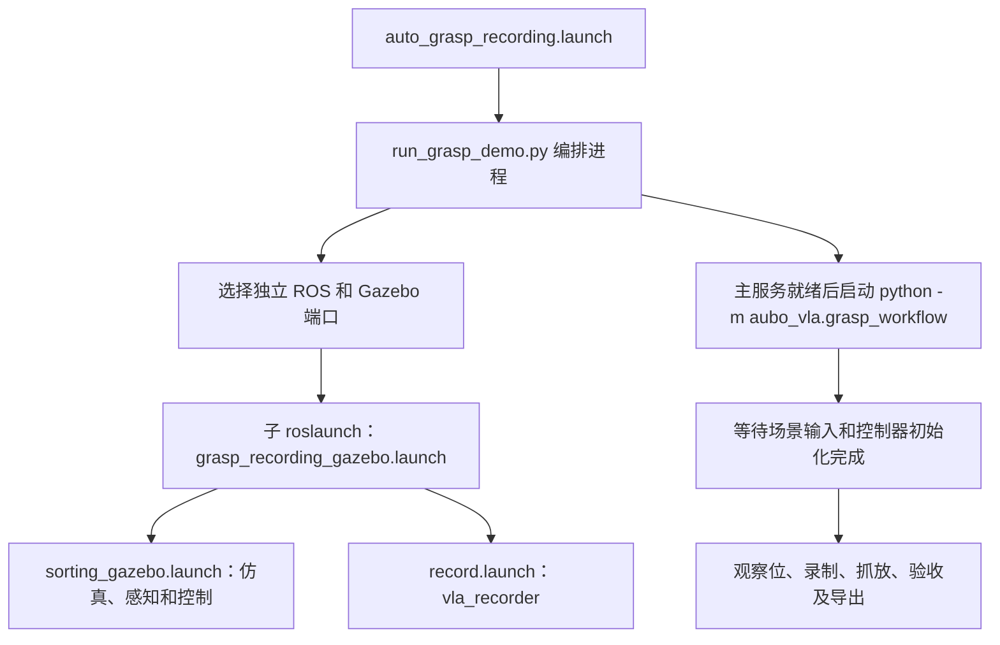
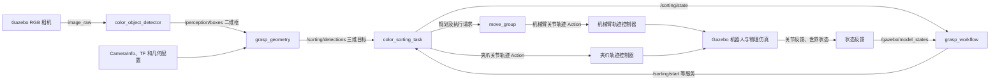

# 自动抓放采集：启动顺序、节点与数据传递

当前入口为 `roslaunch aubo_vla auto_grasp_recording.launch`。
它完成现有分拣程序的自动运行、示范采集、结果验收和动作导出。
当前运动由感知、分拣状态机和 MoveIt 驱动；VLA 模型没有参与这次运动决策。
语言指令作为 episode 的任务标签写入数据集。

## 1. 程序如何启动



外层 launch 只启动编排进程。它通过环境变量为子场景分配独立的
`ROS_MASTER_URI` 和 `GAZEBO_MASTER_URI`，防止旧场景的模型、控制器和时钟冲突。
`run_grasp_demo.py` 不调用 `rospy.init_node`，所以它是由 roslaunch 管理的进程，
不作为业务节点出现在子场景的 `rosnode list` 中。

子 launch 会并行启动多个进程。XML 文件中的书写次序不是业务就绪保证；
控制器生成器等待 controller_manager 服务，分拣节点等待控制器初始化，
工作流等待场景消息及任务的 IDLE/READY 状态，之后才发出运动请求。

`execute_grasp_workflow.py` 是直接调用工作流的兼容入口；当前完整 launch 使用
`python -m aubo_vla.grasp_workflow` 创建工作流子进程，没有再启动这个兼容入口。

## 2. 子场景启动了哪些节点

| 节点或组件 | 作用 |
| --- | --- |
| ROS master、rosout | 子场景的节点注册与日志服务 |
| `/gazebo`（gzserver） | 仿真世界、方块、相机插件、机器人控制插件和物理反馈 |
| Gazebo 窗口（gzclient，gui=true） | 显示实际仿真运动及物体位置 |
| `/spawn_urdf` | 加载 `aubo_i5` 机器人模型，成功后退出 |
| `/spawn_sorting_pads` | 加载分拣区域标记，成功后退出 |
| `/aubo_i5/controller_spawner` | 加载关节状态、机械臂轨迹和夹爪轨迹控制器 |
| `/aubo_joint_state_relay` | 将命名空间内关节反馈转发到 `/joint_states`，供模型状态和 MoveIt 使用 |
| `/robot_state_publisher` | 根据关节状态发布机器人各连杆的 TF |
| `/workspace_camera_mount_tf`、`/workspace_camera_color_tf`、`/workspace_camera_optical_tf` | 发布固定相机的静态标定 TF |
| `/move_group` | MoveIt 的规划、运动学、碰撞场景及轨迹执行 |
| `/color_object_detector` | 从 RGB 图像提取颜色目标的二维旋转框 |
| `/grasp_geometry` | 将二维框转换为基座参考系中的三维抓取目标 |
| `/color_sorting_task` | 管理目标队列及抓取、抬升、搬运、放置状态机 |
| `/vla_recorder` | 同步采集图像、关节反馈、相机标定与图像时刻 TCP 位姿 |
| `/vla_grasp_recording_check_<随机后缀>` | 工作流节点，调用服务、监听任务状态和方块世界位置、验收及导出 |
| RViz（rviz=true） | 显示机器人状态与 MoveIt 规划信息 |

controller_manager 和三个控制器运行于 Gazebo 的 `gazebo_ros_control` 插件内部，
不是三个独立 ROS 可执行进程。相机及接触辅助抓取插件也由 Gazebo 加载。
具体匿名节点后缀和 GUI 节点名称以本次节点列表为准。

## 3. 自动执行顺序

1. 等待场景就绪，确认 `/use_sim_time=true`、三个方块存在、分拣初始化完成。
2. 调用 `/sorting/move_to_observation`，等待 `/sorting/state` 返回 READY。
3. 发布 `/vla_recorder/instruction`，固定“三个颜色方块分别放到对应区域”的任务标签。
4. 调用 `/vla_recorder/start`，创建 episode，并核对该 episode 的指令已固定。
5. 调用 `/sorting/start`，分拣状态机预留目标，再逐个执行抓放。
6. 每个目标执行：张开夹爪、到预抓取位、下降、接触辅助固定、闭合、抬升、
   移到放置区、下降、张开并解除固定、退离。新鲜有效观测到达后才预留下一个目标。
7. 无剩余目标时重新观察确认，回到 `down` 姿态，工作流等待最终 READY。
8. 检查方块世界位置：每个方块至少抬升 5 cm，最终 XY 距对应中心不超过 5 cm，
   最终高度为 0.12±0.03 m。通过后调用 `/vla_recorder/finish_success`。
9. 检查 episode 的图片、标定、时间同步和采样周期，导出 `actions.jsonl`。
10. 保存验收报告，成功后保留场景，按 Ctrl+C 清理本次子进程。

分拣服务的返回值通常表示命令被接受。工作流还会监听状态，等待操作完成；
不会收到服务返回后立刻认定抓放成功。控制、验收或数据检查失败时报告不通过；
仍在录制的 episode 会尝试中止，运行日志和数据保留。
同颜色有多个物体或改为 can/box 时，当前三个固定方块的验收规则需要另行配置。

## 4. 感知与运动的数据链



| 接口 | 数据及用途 |
| --- | --- |
| `/workspace_camera/color/image_raw` | `sensor_msgs/Image`，颜色检测及记录器的原始图像 |
| `/workspace_camera/color/camera_info` | `sensor_msgs/CameraInfo`，相机内参与图像尺寸 |
| `/workspace_camera/aligned_depth_to_color/image_raw` | 对齐深度图，共用几何节点订阅；默认 table 模式主要使用标定和桌面投影，depth 模式使用深度估计高度 |
| `/perception/boxes` | `aubo_perception/YoloDetectionArray`，当前由颜色节点发布，包含类别、中心、尺寸、角度等二维信息 |
| `/sorting/detections` | `aubo_perception/DetectedObjectArray`，三维位置、类别、抓取宽度/角度和观测有效性，供目标队列使用 |
| `/aubo_i5/aubo_i5_controller/follow_joint_trajectory` | 机械臂 `FollowJointTrajectory` Action，MoveIt 输出带时间的六关节轨迹 |
| `/aubo_i5/gripper_controller/follow_joint_trajectory` | 夹爪 `FollowJointTrajectory` Action，分拣节点输出 `joint1`、`joint2` 轨迹 |
| `/sorting/grasp/attach`、`/sorting/grasp/detach`、`/sorting/grasp/status` | Gazebo 接触辅助抓取的请求与反馈，帮助小物体在仿真中随夹爪运动 |
| `/sorting/state` | `std_msgs/String`，任务阶段及错误信息 |
| `/gazebo/model_states` | `gazebo_msgs/ModelStates`，工作流独立验证实际抬升与放置 |

二维框不会直接变成关节指令。几何节点先生成抓取目标，再由分拣程序选择和
规划目标位姿，MoveIt 计算机械臂轨迹，控制器在 Gazebo 中执行。
当前入口固定为 `detector=color`，未启动 YOLO 推理节点。

## 5. 采集的数据链

```mermaid
flowchart LR
    I[RGB 图像] --> R[vla_recorder]
    J[/aubo_i5/joint_states 原始反馈] --> R
    C[CameraInfo] --> R
    T[图像时间戳对应的 TF] --> R
    CLK[/clock] --> R
    W[grasp_workflow] -->|指令标签、开始与结束服务| R
    R --> E[episode.json、samples.jsonl、images/]
    E --> V[inspect_episode 完整性检查]
    V --> A[actions.jsonl 实测动作差分]
```

默认采样 2 Hz，图像与原始关节消息按时间戳配对，允许差值为 0.05 s。
记录器查询图像时刻的 `base_link → tcp_link` 与相机 TF，而不是最新 TF。
`/joint_states` 转发消息可能重复缓存反馈，所以采集使用 `/aubo_i5/joint_states`。
仿真暂停或时钟回退会中止当前 episode，不能拼接前后两段数据。

每条动作对应 `image(t)` 和 `pose(t) → pose(t+dt)` 的实测差分，夹爪标签采用
下一采样时刻的归一化反馈。它不是 MoveIt 的控制命令，也没有在导出后重新执行。
写入字段、旋转方向和夹爪标定详见 [动作规范](ACTION_SCHEMA.md)。

输出根目录默认是 `/home/zlab/aubo_vla_data`（其他账户使用自己的 HOME）。
`run_*/run.json` 保存本次独立主服务地址和运行状态，`report.json` 保存验收证据，
`launch.log` 保存子场景日志；`episode_*/` 保存图片、逐帧观测与动作导出。

由于子场景使用独立 master，在普通终端运行 `rostopic list` 可能看不到这些业务节点。
要手动查看，需要先将 `ROS_MASTER_URI` 设置为本次 `run.json` 中的 `ros_master`。
若要连接对应 Gazebo 场景，同时使用其中的 `gazebo_master` 设置 `GAZEBO_MASTER_URI`。
