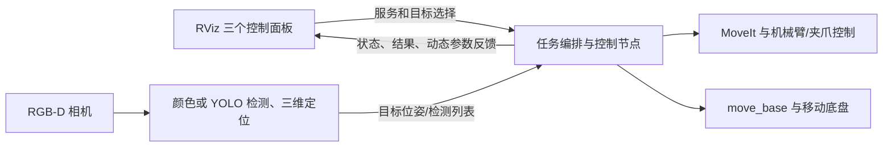

# 移动机器人视觉分拣系统：控制界面整理与动态调参方案

> 文档性质：软件著作权材料初稿与界面改造记录。依据本仓库源码整理，2026-09-22。界面改造代码已写入工作区，但尚待 ROS 环境编译和 Gazebo/实机验收；申报功能应以验收后的版本为准。软件名称、版本、著作权人、完成日期须由项目方核定。

### 当前改造状态

| 模块 | 已写入工作区的改动 | 待验证 |
| --- | --- | --- |
| 分拣流程 | 默认 C++ 核心新增 `SortingTask.cfg` 和动态服务；RViz 面板可读写六项参数 | ROS 构建、空闲改参、动作中拒绝、实机边界；备用 Python 任务暂未接入 |
| 视觉伺服 | RViz 面板连接已有动态服务，可读写八项参数 | ROS 构建、仿真在线调参、控制稳定性 |
| 导航分拣 | 面板订阅参数更新，比较提交值与节点返回值 | ROS 构建、多工位和任务执行中拒绝场景 |

## 1. 软件概况与申报边界

**建议名称**：移动机器人视觉导航分拣控制软件（暂定）。软件以 ROS 1、RViz 面板为操作入口，编排视觉识别、机械臂视觉伺服、抓取分拣和移动底盘导航。可按实际版本将三个控制面板作为同一软件的三个功能模块描述。实际软著提交材料需与拟登记版本的代码、截图和运行说明一致。

| 模块 | 对应源码 | 主要职责 |
| --- | --- | --- |
| 分拣流程控制界面 | `aubo_mobile_robot/aubo_mobile_sorting/src/sorting_panel.cpp`；算法在 `aubo/aubo_sorting_core` | 操作观察、开始、停止、开夹爪、归位，显示状态和识别数量 |
| 视觉伺服控制界面 | `aubo/aubo_ros_control/src/visual_servo_panel.cpp`；控制器在 `visual_servo.cpp` | 选择目标，启动“规划接近→视觉伺服”两阶段流程，停止、复位，显示目标与控制状态 |
| 导航分拣控制界面 | `aubo_mobile_robot/aubo_mobile_nav_sorting/src/nav_sorting_panel.cpp`；任务编排在 `navigation_sorting_mission.cpp` | 设置工位、预停靠和导航参数，启动、停止、恢复任务，显示多工位进度 |

仓库还包含 ROS Navigation、MoveIt、相机驱动、Gazebo、AUBO SDK 等依赖或上游组件。软著的自研功能说明与源程序选页应聚焦本项目的面板、任务编排、视觉伺服及分拣核心；第三方代码和模型权重应单独核对来源、授权及是否纳入提交范围。固定机械臂场景由 `aubo/aubo_sorting` 组合，移动分拣场景由 `aubo_mobile_robot/aubo_mobile_sorting` 组合，两者复用 `aubo_sorting_core`。

## 2. 软件功能和操作流程

### 2.1 分拣流程控制界面

RViz 插件标识为 `aubo_mobile_sorting/SortingPanel`。面板显示 `/sorting/state` 和 `/sorting/detection_summary`，提供五项操作：移动到相机观察位、开始分拣、停止当前任务、张开夹爪、机械臂归位。对应服务依次是 `/sorting/move_to_observation`、`/sorting/start`、`/sorting/stop`、`/sorting/open_gripper`、`/sorting/home`。服务响应会显示在面板中。

典型流程：启动相机、控制器、MoveIt 与任务节点 → 机械臂到观察位 → 查看检测结果 → 点击开始分拣 → 识别目标、预抓取、夹取、抬升、移动到分类放置区、松爪 → 归位或继续处理目标。分拣核心发布状态和识别摘要，并负责服务受理、动作顺序及停止处理。现已新增参数区与 `/color_sorting_task/set_parameters`，仅默认 C++ 任务节点提供该服务；参数初值仍来自 `sorting.yaml`。

### 2.2 视觉伺服控制界面

RViz 插件标识为 `aubo_ros_control/VisualServoPanel`。面板可选择红、绿、蓝或任意已配置目标，向 `/visual_servo/target_selection` 发布目标选择；通过 `/visual_servo/set_enabled` 和 `/visual_servo/perception/set_enabled` 启停控制与识别，通过 `/visual_servo/reset` 和 `/visual_servo/perception/reset` 复位。它订阅 `/visual_servo/state`、`/visual_servo/perception_state`、`/visual_servo/target_pose`，显示系统就绪、阶段和三维目标位置。两阶段逻辑为 MoveIt 规划接近，再由位置视觉伺服闭环对齐。

视觉伺服控制器已有 `aubo/aubo_ros_control/cfg/VisualServo.cfg` 和 `dynamic_reconfigure::Server`。可调项包含位置/姿态增益、线/角速度上限、对齐死区、目标位姿与偏移、目标丢失策略及时间参数等。服务位于 `/aubo_visual_servo/set_parameters`，运行时还发布 `/aubo_visual_servo/parameter_updates`。面板现已连接该服务并提供八项常用参数控件，无需另开 rqt；仍须在 ROS 环境验收。

### 2.3 导航分拣控制界面

RViz 插件标识为 `aubo_mobile_nav_sorting/NavSortingPanel`。面板显示 `/nav_sorting/state`、`/sorting/state` 和多工位进度，提供开始、停止、停止后重新确认三个操作，分别调用 `/nav_sorting/start`、`/nav_sorting/stop`、`/nav_sorting/recover_stop`。单工位可编辑工位目标 `(x, y, yaw)`、预停靠位姿、近场精停开关、桌边最小间距、单次导航超时及重试次数；多工位时工位位姿由 `workstations` 配置决定，面板将相应控件禁用。

此模块**已经实现面板直接动态调参**：任务节点提供 `NavSorting.cfg` 与 `/nav_sorting_mission/set_parameters`，面板用 `dynamic_reconfigure/Reconfigure` 提交修改，并从参数服务器读取当前值。任务执行期间节点会拒绝修改并返回现值；面板也在任务忙碌时禁止提交。面板现已订阅参数更新，并在提交后核对节点返回值；无需启动 `rqt_reconfigure`。

### 2.4 模块间数据流



## 3. 直接在现有界面动态调参：结论

**可以，而且导航分拣面板已经证明这条方案在当前工程中可行。**`dynamic_reconfigure` 是 ROS 节点提供的参数服务与更新话题，`rqt_reconfigure` 只是其中一种客户端。RViz 插件同样可以作为客户端：读取当前配置、显示控件、调用 `set_parameters`、接收实际生效值。界面应调用节点的动态配置接口；单纯 `rosparam set` 不会让已加载参数的控制循环自动使用新值。ROS 官方客户端 API 也提供读取配置和提交更新的能力：[ROS dynamic_reconfigure Client API](https://docs.ros.org/jade/api/dynamic_reconfigure/html/dynamic_reconfigure.client.Client-class.html)。

| 界面 | 当前状态 | 拟增加的工作 |
| --- | --- | --- |
| 导航分拣 | 面板↔动态服务已连通，已补参数更新订阅与返回值检查 | 在 ROS 环境验证任务执行中的拒绝反馈 |
| 视觉伺服 | 控制器和面板已连接，常用参数可在 RViz 调节 | 在 Gazebo 验证运行中调参及状态切换 |
| 分拣流程 | C++ 核心和面板已连接，六项参数可在 RViz 调节 | 在 Gazebo 验证空闲修改、动作中拒绝；明确 Python 备用入口的行为 |

## 4. 改造设计

### 4.1 共同交互规则

1. 各面板在节点上线后读取**节点当前实际配置**，不把 `.cfg` 默认值当作实机当前值；控件显示单位、合法范围和当前值。
2. 用户编辑后点击“应用参数”；面板通过 `set_parameters` 发送一次配置请求，随后以**服务响应或 `parameter_updates` 中的实际值**刷新控件。节点拒绝或裁剪时，界面显示实际结果，不能直接提示“已应用”。
3. 节点离线时禁用应用按钮并显示连接状态；通信超时应有明确反馈。参数与动作命令分区，停止按钮始终容易找到。
4. 加载值来自 YAML；在线更改只影响当前进程。需要持久化时，另设“导出当前参数”功能，经人工审核后写入场景 YAML。不要自动覆盖已标定的生产配置。
5. 服务端验证数值范围和参数间约束。尤其是机械臂速度、夹爪接触、桌面高度、TF 与碰撞边界，不能仅靠界面输入范围保证安全。
6. 如果多个工具都可改参，面板应订阅 `/节点名/parameter_updates` 以保持显示同步；界面不是参数唯一来源。

### 4.2 视觉伺服面板

复用现有 `/aubo_visual_servo/set_parameters`，无需再开一个调参节点。第一版面板建议只暴露操作中最常用的 `linear_gain`、`angular_gain`、`max_linear_velocity`、`max_angular_velocity`、`position_deadband`、`orientation_deadband`、`target_timeout`、`loss_strategy`。这些字段在 `VisualServo.cfg` 已有定义，控件范围直接取该文件。目标坐标、TCP 偏移、姿态和安全距离影响几何基准，放入“高级参数”，应用前提示确认坐标系与目标单位。

控制器的动态回调已用互斥量保护参数，并在改参后清理旧指令队列；新增面板客户端仍需通过仿真验证运行中调参时的状态跳变。底层后端类型、机器人 IP、坐标系、关节硬限制等继续通过配置文件和重启确定，不放入在线控件。

### 4.3 分拣流程面板与核心

为 `aubo_sorting_core` 的 C++ 任务节点新增 `SortingTask.cfg`。第一版建议只纳入抓取前可解释、可验证的有限参数：`detection_timeout`、`detection_samples`、`grasp_offset_x/y`、`velocity_scaling`、`acceleration_scaling`。界面按“视觉采样”“抓取偏移”“运动速度”分组，显示当前值、单位和适用时机。

服务端在 `IDLE`、`READY` 或 `STOPPED` 且无动作线程执行时接受新值；在 `SORTING`、`PICKING`、`HOMING` 等运动状态拒绝并回传原值。动态回调与任务线程共享参数须使用同一把锁或在任务启动时拍摄配置快照，避免读写竞态。`grasp_offset_x/y` 需限幅，并在重新开始前确认视觉与夹爪中心；运动缩放须符合 MoveIt 控制限制。跨参数约束与拒绝信息应写入节点日志和面板反馈。

`table_z`、物体高度、相机外参、夹爪机械开合量、放置点、碰撞场景、类别映射等先继续保留为场景 YAML/工位配置，不作为首批动态参数。这些数据关联感知几何、规划场景或硬件标定，在线改一个字段可能造成各模块配置不一致。备用 Python 任务脚本也需要相同动态行为，或在界面中明确仅支持默认 C++ 节点；不能出现两套实现同名服务但语义不同。

### 4.4 导航分拣面板

保留现有 `NavSorting.cfg` 和服务。面板订阅 `/nav_sorting_mission/parameter_updates` 后，可以在其他客户端修改时自动显示新值；应用请求要检查响应配置是否等于请求值。多工位表中的工位坐标不是 `NavSorting.cfg` 的动态字段，不应通过单工位 `goal_x/y/yaw` 控件修改。任务忙碌时由面板和任务节点双重拦截；`STOP_UNCONFIRMED` 解除前仍禁止新任务。

### 4.5 界面建议布局

```text
┌ 分拣流程 ───────────────┐  ┌ 视觉伺服 ─────────────────┐  ┌ 导航分拣 ─────────────────┐
│ 状态 / 识别数量          │  │ 目标 / 阶段 / 目标位置      │  │ 任务状态 / 工位进度         │
│ 观察 开始 停止 夹爪 归位 │  │ 启动 停止 复位              │  │ 开始 停止 恢复             │
│ [视觉采样] [抓取偏移]    │  │ [增益与限速] [丢失恢复]     │  │ [工位与预停靠] [导航超时]  │
│ 读取当前值 / 应用参数    │  │ 读取当前值 / 应用参数       │  │ 读取当前值 / 应用参数      │
│ 实际生效值 / 错误反馈    │  │ 实际生效值 / 错误反馈       │  │ 实际生效值 / 错误反馈      │
└──────────────────────────┘  └────────────────────────────┘  └────────────────────────────┘
```

这三个面板可同时放入同一 RViz 布局，但各自连接对应节点的参数服务，不建议把三个节点的全部参数混成一个无来源的大表。

## 5. 实施顺序与验收

| 阶段 | 交付内容 | 验收要点 |
| --- | --- | --- |
| 1 | 视觉伺服面板连接已有动态服务 | 不开 rqt，在面板修改增益/限速；控制器收到新值，刷新后显示一致；节点离线提示明确 |
| 2 | 分拣核心新增动态服务并接入面板 | 空闲改参生效；抓放过程中拒绝；C++ 默认入口和 Python 备用入口行为有说明；越界值被拒绝或裁剪并反馈 |
| 3 | 导航面板同步优化 | 外部改参后界面自动更新；忙碌时保持旧值；多工位坐标仍按工位配置运行 |
| 4 | 软件版本与软著材料定稿 | 记录版本号、功能截图、操作步骤、原创代码选页、第三方依赖清单；截图与提交版本相符 |

验证建议在 ROS/Gazebo 环境做，至少覆盖：启动时 YAML 初值、面板应用、外部改参同步、节点重启恢复初值、网络或节点断开、越界参数、任务运行中改参拒绝、停止后重新启用、真机限速核对。当前 Windows 工作空间已通过新 `.cfg` 的 Python 语法检查、两个 `package.xml` 的 XML 解析、控件与 `.cfg` 字段对齐检查、`git diff --check`。本机没有 `catkin_make` 和 ROS C++ 依赖，**尚未编译或进行 Gazebo/实机验证**。

## 6. 可用于软著说明书的功能摘要初稿

本软件面向移动机械臂的视觉识别、抓取分拣和自主导航任务，提供基于 RViz 的图形化控制界面。操作者可在分拣界面完成观察位移动、目标分拣、停止、夹爪操作和机械臂归位，并查看任务状态与识别结果；可在视觉伺服界面选择跟踪目标、启动规划接近及闭环对齐、停止或复位控制流程，并查看视觉目标和伺服状态；可在导航分拣界面设置工位及预停靠参数、执行多工位任务、查看任务进度和异常状态。系统通过 ROS 服务、话题和参数机制连接视觉感知、运动规划、机械臂控制和移动导航模块，支持仿真及配置后的真实机器人运行。

**验收后可补充的摘要句**：三个控制面板均可直接读取和应用各自节点的动态参数，并反馈实际生效值，无需另启独立调参窗口。当前代码已接入，尚待 ROS 环境验收后用于现行版本申报材料。

## 7. 核对依据

- 分拣面板：`aubo_mobile_robot/aubo_mobile_sorting/src/sorting_panel.cpp`、`plugin_description.xml`、`README.md`。
- 分拣参数：`aubo/aubo_sorting_core/src/task_parameters.cpp`、`CMakeLists.txt`、`package.xml`。
- 视觉伺服：`aubo/aubo_ros_control/src/visual_servo_panel.cpp`、`src/visual_servo.cpp`、`cfg/VisualServo.cfg`、`launch/visual_servo_core.launch`、`VISUAL_SERVO.md`。
- 导航分拣：`aubo_mobile_robot/aubo_mobile_nav_sorting/src/nav_sorting_panel.cpp`、`src/navigation_sorting_mission.cpp`、`cfg/NavSorting.cfg`、`CONTROL_FLOW.md`。
