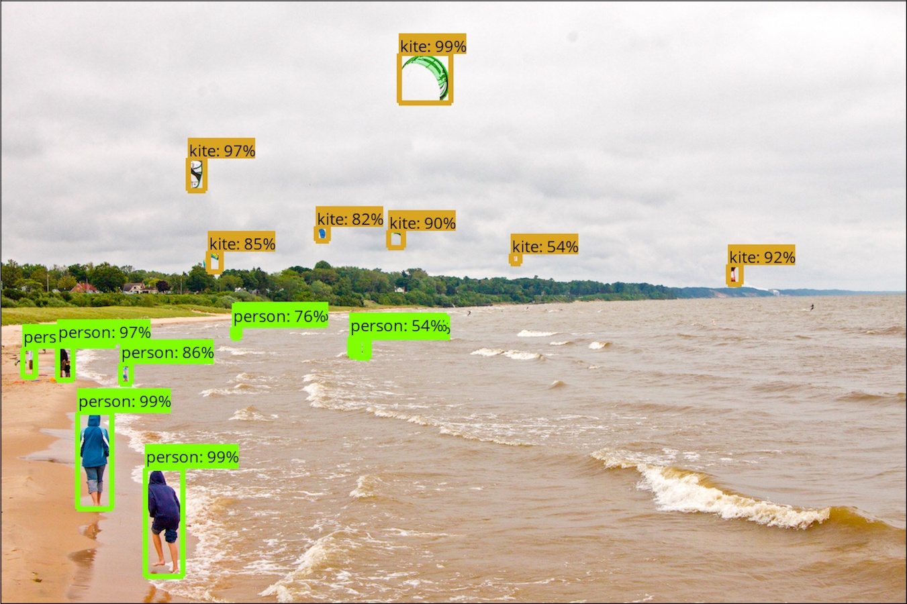

# TensorFlow 目标检测 API

TensorFlow 目标检测 API 是构建在 TensorFlow 之上的开源框架，用于创建、训练和部署能够在单张图像中定位并识别多个目标的模型。

<p align="center">
  
</p>

欢迎为项目贡献代码。如果在论文中使用该 API，请考虑引用：

```text
"Speed/accuracy trade-offs for modern convolutional object detectors."
Huang J, Rathod V, Sun C, Zhu M, Korattikara A, Fathi A, Fischer I, Wojna Z,
Song Y, Guadarrama S, Murphy K, CVPR 2017
```

[[论文](https://arxiv.org/abs/1611.10012)] [[BibTeX](https://scholar.googleusercontent.com/scholar.bib?q=info:l291WsrB-hQJ:scholar.google.com/&output=citation)]

## 维护者

- Jonathan Huang（[jch1](https://github.com/jch1)）
- Vivek Rathod（[tombstone](https://github.com/tombstone)）
- Ronny Votel（[ronnyvotel](https://github.com/ronnyvotel)）
- Derek Chow（[derekjchow](https://github.com/derekjchow)）
- Chen Sun（[jesu9](https://github.com/jesu9)）
- Menglong Zhu（[dreamdragon](https://github.com/dreamdragon)）
- Alireza Fathi（[afathi3](https://github.com/afathi3)）
- Zhichao Lu（[pkulzc](https://github.com/pkulzc)）

## 文档目录

快速开始：

- [使用预训练模型进行推理的 Jupyter Notebook](object_detection_tutorial.ipynb)
- [训练宠物目标检测器](g3doc/running_pets.md)

环境配置：

- [安装](g3doc/installation.md)
- [配置目标检测流水线](g3doc/configuring_jobs.md)
- [准备输入数据](g3doc/preparing_inputs.md)

运行：

- [本地运行](g3doc/running_locally.md)
- [云端运行](g3doc/running_on_cloud.md)

扩展主题：

- [检测模型库](g3doc/detection_model_zoo.md)
- [导出推理模型](g3doc/exporting_models.md)
- [自定义模型结构](g3doc/defining_your_own_model.md)
- [使用自定义数据集](g3doc/using_your_own_dataset.md)
- [支持的评估协议](g3doc/evaluation_protocols.md)
- [Open Images 推理和评估](g3doc/oid_inference_and_evaluation.md)
- [实例分割](g3doc/instance_segmentation.md)

## 获取帮助

使用问题请在 [Stack Overflow](https://stackoverflow.com/) 提问并添加 `tensorflow` 和 `object-detection` 标签。确认属于代码缺陷后，再到 [TensorFlow Models 问题跟踪器](https://github.com/tensorflow/models/issues)提交，并在标题前加上 `object_detection`。提交前请先查看[常见问题](g3doc/faq.md)。

## 历史版本摘要

- 2018-04-30：发布基于 ResNet-101、使用 AVA 2.1 训练的 Faster R-CNN 动作检测器。
- 2018-04-02：加入 MobileNet V2 + SSDLite 支持并发布 COCO 预训练权重。
- 2018-02-09：加入 Mask R-CNN 系列实例分割模型支持。
- 2017-11-17：加入 Open Images 评估协议、推理/评估工具及预训练模型。
- 2017-11-06：更新模型库，并加入多种 Faster R-CNN 特征提取器。
- 2017-10-31：发布基于 NASNet-A 的 Faster R-CNN 模型，在当时的 COCO test-dev 上达到 43.1% mAP。
- 2017-08-11：Android 检测示例支持该 API 训练的模型。
- 2017-06-15：首批发布 SSD、R-FCN、Faster R-CNN 模型、COCO 权重、Notebook，以及本地和云端训练工具。
